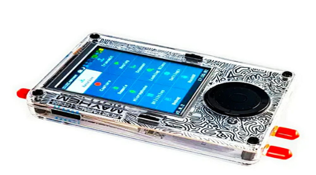
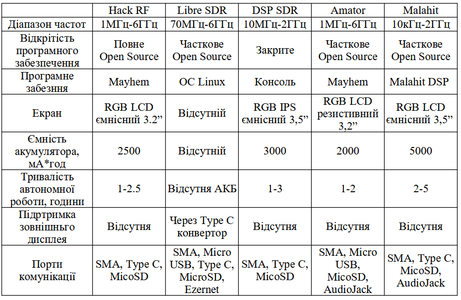

# **АНАЛІТИЧНИЙ ОГЛЯД ІСНУЮЧИХ ПОРТАТИВНИХ КОМПЛЕКСІВ ВИЯВЛЕННЯ ТА АНАЛІЗУ РАДІОСИГНАЛІВ**

У цьому розділі розглядаються сучасні портативні комплекси для виявлення, аналізу та обробки радіосигналів, що використовуються для моніторингу, тестування та дослідження у сфері радіозв'язку. Особлива увага приділяється програмно-визначуваним радіостанціям (SDR), які забезпечують гнучкість, багатофункціональність та робота у різному діапазоні частот.

## Опис технологій

Програмно-визначуване радіо (SDR, Software Defined Radio)
>>> ULVERSOY, Tore. Software defined radio: Challenges and opportunities. IEEE Communications Surveys & Tutorials, 2010, 12.4: 531-550.
— це підхід, при якому більшість функцій традиційного радіоапаратного забезпечення (наприклад, фільтрація, демодуляція, обробка сигналу) реалізується програмно, а не апаратно. Це дозволяє змінювати режими роботи пристрою, підтримувати різні протоколи та стандарти без необхідності заміни апаратної частини. Основні переваги SDR:

- Універсальність — можливість роботи з різними типами сигналів та протоколів.
- Гнучкість — швидка зміна налаштувань, частот, режимів роботи через програмне забезпечення.
- Компактність і портативність — сучасні SDR-пристрої мають невеликі розміри та можуть працювати автономно.
- Масштабованість — можливість оновлення функціоналу шляхом зміни або доповнення програмного забезпечення.
- Широкий спектр застосування — від моніторингу стільникових мереж і аналізу бездротових протоколів до тестування безпеки, наукових досліджень та навчання.

SDR-комплекси дозволяють здійснювати прийом, аналіз, запис, відтворення та передачу радіосигналів у широкому частотному діапазоні, що робить їх незамінними інструментами для фахівців у сфері радіозв'язку, радіоаматорів, дослідників та інженерів.

### Радіостанція Hack RF One Portapack H4 Mayhem SDR 1 МГц – 6 ГГц.

HackRF One із PortaPack H4 та прошивкою Mayhem — це багатофункціональна портативна SDR-платформа, призначена для прийому, передачі й аналізу радіосигналів у широкому діапазоні частот. Пристрій базується на відкритих програмних рішеннях і може використовуватися для моніторингу мобільних мереж, дослідження бездротових стандартів, налаштування радіочастот, тестування захищеності бездротових систем та інших завдань.
[HackRF One !](https://fd24.com.ua/ua/p1044872164-sdr-radiostantsiya-antennami.html?source=merchant_center&gad_source=1&gad_campaignid=16695681573&gbraid=0AAAAACqF10_-rY4lJZlaJmtpxI3HFCwSQ&gclid=CjwKCAjw56DBBhAkEiwAaFsG-tMrTVbThssU7Zpa5kQyvDk9m0I4ZMkaidrQvP96XgwxpQHuhkZQ7RoCglAQAvD_BwE).

Оновлений модуль PortaPack H2 розширює можливості HackRF One завдяки кольоровому сенсорному дисплею, навігаційним клавішам і енкодеру для зручного управління. Встановлена прошивка Mayhem значно розширює функції аналізу, тестування та роботи з бездротовими мережами.

У порівнянні з попередньою версією, H4 отримала покращений матовий екран, порт GPIO для підключення додаткових пристроїв, дисплеїв і сенсорів, а також оновлену систему живлення: один перемикач для вмикання/вимикання, вдосконалене управління акумулятором, швидке заряджання через Type-C, відсутність витоків струму та саморозряду.

Технічні характеристики

* Режим роботи: напівдуплексний
* Робочий частотний діапазон: 1 МГц – 6 ГГц
* Частота дискретизації: від 2 до 20 MSPS
* Програмно налаштований смуговий фільтр для прийому та передачі
* Програмно кероване живлення антенного виходу (до 50 мА при 3.3 В)
* Кольоровий сенсорний дисплей з діагоналлю 3.2 дюйма
* Вбудований гучномовець
* Зручні кнопки для налаштування
* Антенний роз’єм: SMA (гніздо)
* Аудіороз’єм для гарнітури/мікрофона: 3.5 мм
* GPIO-інтерфейс для підключення зовнішніх пристроїв
* Живлення: вбудований акумулятор на 2500 мА·год
* Матеріал корпусу: пластик ABS
* Габарити: 8 × 12,5 × 2,5 см

### Радіостанція Libre SDR PLUTO з Zynq 7020 70 МГц – 6 ГГц.

LibreSDR є альтернативою відомого SDR-пристрою ADALM-PLUTO (або PlutoSDR), виконаною у металевому корпусі для підвищення міцності та кращого відведення тепла. [Детальніше про LibreSDR](https://fd24.com.ua/ua/p2465955107-sdr-radiostantsiya-antennami.html).

Плата пристрою виконана на друкованій платі та оснащена 8-бітовим цифро-аналоговим перетворювачем. На ній розміщені такі інтерфейсні порти:

* два коаксіальні роз’єми MMCX для підключення сигналів синхронізації 1 PPS і 10 МГц;
* порт RJ-45 для Gigabit Ethernet, який забезпечує передачу IQ-даних і доступ до консолі вбудованої Linux-системи;
* два роз’єми Type-C (OTG і Debug):
    * OTG дозволяє підключатися до Linux-консолі через послідовний порт,
    * Debug використовується для відлагодження та завантаження прошивки через JTAG за допомогою інструментів Xilinx,
    * обидва роз’єми також застосовуються для живлення LibreSDR;
* слот для MicroSD-картки;
* чотири SMA-роз’єми для підключення двох приймальних і двох передавальних трактів.

Додатково на платі розташована прихована кнопка DFU для відновлення заводського програмного забезпечення. У LibreSDR інтегровано радіочастотний модуль AD9363.

**Ключові технічні характеристики:**

* Мікросхема: XC7Z020-2CLG400I xc7z020-2I
* RF-модуль AD9363, налаштований як AD9361 (діапазон 70 МГц ~ 6 ГГц)
* Кількість каналів: 2 на передачу, 2 на прийом
* Розрядність ЦАП/АЦП: 12 біт
* Робочий частотний діапазон: 70 МГц – 6 ГГц
* Генератор опорної частоти: VCTCXO 40 МГц, стабільність 0,5 ppm
* Система-на-кристалі: Zynq7010, FPGA: 28 Кб
* Оперативна пам’ять: 512 МБ
* FLASH-пам’ять: 32 МБ
* USB-інтерфейс: версія 2.0, підтримка OTG
* Мережевий інтерфейс: Gigabit Ethernet (1000 Мбіт/с)
* Підтримка завантаження з MicroSD-картки
* Живлення: 5 В, 2 А через MicroUSB
* Підтримка режимів дуплексу TDD і FDD
* Смуга пропускання: від 200 кГц до 20 МГц
* Корпус з алюмінієвого сплаву
* Розміри: 11,3 × 7,2 × 3 см
* Вага: 565 г

### Радіостанція 1.10D DSP SDR 10 МГц-2 ГГц

[Приймач 1.10D DSP SDR](https://www.joom.com/uk/products/67b2acd0683d8101ba932088?variant_id=67b2acd0683d815eba93208a)
від 10 кГц до 2 ГГц має наступні особливості:

1. Режими демодуляції: Приймач DSP SDR підтримує AM, SSB, NFM, WFM, CW, побудований на SDR-архітектурі з використанням RF-фронтенду msi001 для 12-бітного оцифрування сигналу та процесора stm32h743 із тактовою частотою до 480 МГц.
2. Чутливість і автономність: Діапазон частот пристрою становить 10 кГц–2,0 ГГц (версія 1.10d), чутливість — 0,3 мкВ при 10 дБ до 250 МГц. Вбудований акумулятор на 3000 мА·год забезпечує тривалу роботу без підзарядки.
3. Фільтрація: Приймач оснащений подвійним антенним входом, модулем атенюатора переднього каскаду з ослабленням до 30 дБ, високим вхідним опором, покращеною чутливістю на коротких хвилях і чотирма додатковими фронтальними фільтрами.
4. Багатофункціональність: Пристрій має розширені можливості — змінна ширина фільтра, адаптивне та порогове шумозаглушення, шумоподавлення, автоматичне регулювання підсилення (AGC), еквалайзер.
5. USB-підключення: 3,5-дюймовий ємнісний сенсорний дисплей, корпус із друкованої плати для покращеної радіочастотної ефективності, підключення до ПК через USB для передачі даних IQ, аудіо та керування пристроєм.

Специфікація:

* Тип елемента: приймач DSP SDR
* Матеріал: PCB
* Акумулятор: літій-іонний акумулятор 503450 (Побудований в), Ємність: 3000mAh
* Екран: 3,5-дюймовий IPS ємнісний сенсорний екран
* Демодуляція: AM, SSB, NFM, WFM, CW
* Значення частоти: діапазон від 50 кГц до 49,999 МГц, від 50,001 МГц до 249,999 ГГц, від 400 МГц до 2 ГГц
* MCU: потужний stm32h743 із тактовою частотою 480 МГц.
* Потужні функції: змінна ширина фільтра, адаптивний шумоподавлювач, пороговий шумоподавлювач, шумоподавлювач, AGC, еквалайзер.
* Мікросхема демодуляції: використовуйте повністю функціональну, високоінтегровану та надійну мікросхему msi001.
* Підключено: через USB-з’єднання з комп’ютером, для коду, IQ та звукового зв’язку можна реалізувати.

### Радіостанція Amator SDR  1 МГц - 6 ГГц.

[Радіостанція Amator SDR  1 МГц - 6 ГГц.](https://www.joom.com/uk/products/67ea3b1a35422d011b0f5a93?variant_id=67ea3b1a35422dbc1b0f5a95)
має наступні особливості:

1. 3,5 мм звуковий роз'єм: Цей радіотрансивер використовує 3,5-мм аудіороз'єм, тому, підключивши мікрофон, ви можете просто натиснути та утримувати праву бічну кнопку, щоб здійснити дзвінок.
2. Прийом кількох голосових повідомлень: Цей радіотрансивер підтримує прийом голосу в діапазонах SSB, AM, вузькосмугового FM, широкосмугового FM зі спектральним водоспадом.
3. Спіймати та відтворити: Цей радіоприймач дуже спрощує прийом та відтворення бездротових сигналів з пультів дистанційного керування діапазону ISM.
4. Апаратне забезпечення завершено: Цей радіотрансивер оснащений 3,2-дюймовим резистивним сенсорним екраном, навігаційними перемикачами, радіо-виходами, мікрофонними входами, інтерфейсом DC 2.1 та 4-шаровим позолоченим покриттям.
5. Широке застосування: Цей радіоприймач має широкий спектр застосування та може використовуватися на кораблях, автомобілях, електронних лічильниках комунальних послуг, для моніторингу транспондерів тощо.

Специфікація:

* Тип пристрою: Радіоприймач
* Матеріал: Алюмінієвий сплав
* Тип батареї: Літієва батарея 3,7 В 2000 мАг x1 (Поставляється з вбудованою батареєю)
* Антена прийому частотного діапазону: 1 МГц – 6 ГГц

Зловити повтор:

Одна з найкращих переваг радіотрансивера полягає в тому, що він дозволяє дуже легко вловлювати та відтворювати бездротові сигнали з пультів дистанційного керування діапазону ISM.  
Створіть улов. Все, що вам потрібно зробити, це зайти в меню лову, встановити частоту клавішею пульта дистанційного керування, натиснути червону кнопку запису R та натиснути клавішу на пульті дистанційного керування.  
Потім зупиніть запис, щоб зберегти його на карту пам’яті.  
Тепер ви можете перейти до меню Відтворення, вибрати щойно записаний файл і натиснути кнопку Відтворити. Точно такий же сигнал буде передаватися по повітрю, ефективно замінюючи ваш віддалений ключ.

Приймач:

Ви можете легко прослуховувати стандартні радіосигнали NFM та WFM, підключивши динамік до 3,5-мм радіороз'єму Portapack.  
Прийом ADS B легко вмикається на радіопередавачі, вибравши символ індуктора та блискавки у верхньому правому куті.

Апаратної конфігурації:

* Мікрофон TX
* 3,2-дюймовий, 240 x 320 RGB РК-дисплей з резистивним сенсорним екраном
* Навігаційні перемикачі
* Радіовихід
* Вхід мікрофона
* Роз'єм постійного струму 2.1
* 4-шарове позолота

Функції HAVOC включають:

* Відтворення файлів IQ
* Мікрофонна FM-передача з CTCSS
* Декодер CTCSS
* Частотний менеджер (Збереження та завантаження з карти пам'яті з категоріями та коментарями)
* Файловий менеджер
* Програвач звукових файлів Soundboard Wave (Зберігає 8-бітні монофайли) Карта пам'яті, каталог Wav
* Приймач ADS B з видом карти
* Передавач SSTV
* Повністю налаштовувані сигнали передавача
* Передавач POCSAG
* Приймач, декодер POCSAG
* Передавач Морзе (FM-тон та CW)
* Передавачі OOK для звичайних дистанційних кодерів (PT2262, Дверні дзвінки, Віддалені розетки, Деякі гаражі)
* RDS (Система радіоданих) Передавачі PSN, радіотексту та групового зв'язку за часом
* Приймачі метеорологічних радіоехолотів для M10 та M2K2
* Приймач AFSK
* Передавач АФСК (Дзвінок202)
* Передавач синхронізації Nuoptix DTMF
* Універсальний пульт дистанційного керування TouchTunes Jukebox
* LCR (Language de Commande Routier) Генератор повідомлень
* Передавач управління вуличним освітленням (Тони CCIR)
* Прикидатися мертвим у надзвичайних ситуаціях
* Повністю налаштовуваний генератор радіочастотних сигналів
* Вихід радіо RSSI для висоти тону (для пошуку напрямку)

Особливості:

* 4-сторонні кнопки зі стрілками, колесо прокручування та кнопки вибору
* Батарейка-таблетка для збереження налаштувань, дати й часу
* Слот для мікрокартки пам'яті для зберігання даних та коду
* SSB, AM, вузькосмуговий FM, широкосмуговий FM-радіоприйом з каскадним спектром
* Високошвидкісне підключення (18 МГц) Спектральний та каскадний аналіз
* Моніторинг суден (AIS), автомобілів (TPMS), Транспондери електронних лічильників комунальних послуг (ІТРОН ЕРТ)
* Для режиму запуску прошивки для використання з програмним забезпеченням хоста SDR
* Калібрує PPM для точніших налаштувань
* Режим сну економить енергію, вимикаючи лише дисплей

### Радіостанція Malahit DSP2 SDR Radio Firmware 2.40 Receiver 10 кГц - 2 ГГц.

[Malahit-DSP2 SDR](https://www.joom.com/uk/products/67399c645aa1e901d90ed87c?variant_id=67399c645aa1e9c2d90ed87e)
, оригінальний приймач другого покоління, 10 кГц-380 МГц, 404 МГц-2 ГГц. Найновіша прошивка версії 2.40 абсолютно новий оригінальний приймач Malahit-DSP2.

Основні параметри:

* Діапазон частот: 10 кГц-380 МГц, 404 МГц-2 ГГц.
* Ширина панорами: 192 кГц, 96 кГц, 48 кГц.
* Тип модуляції: AM, SSB, DSB, CW, NFM, WFM.
* Чутливість: 0,3 мкВ до 1 ГГц.
* Динамічна смуга пропускання: 82 дБ.
* Антена: роз'єм SMA з внутрішньою різьбою 50 Ом.
* Режим високого імпедансу (DSP2 або DSP1 з додатковою платою)
* Активна антена Bias Tee (DSP2 або DSP1 з додатковою платою)
* Джерело живлення: літій-іонний акумулятор 5000 мА*г.
* Екран: сенсорний РК-дисплей 3,5 дюйма.
* Характеристики програмного забезпечення
* Адаптивне шумозаглушення (NR)
* Порогове шумозаглушення
* Шумозаглушення (NB)
* Автоматичне регулювання підсилення (AGC)
* Автоматичний режекторний фільтр (ANF)
* Стерео FM підтримує аналогове стерео RDS
* Еквалайзер

Цей радіоприймач має широкий спектр застосування та може використовуватися на кораблях, автомобілях, електронних лічильниках комунальних послуг, для моніторингу транспондерів тощо.
3,5-дюймовий IPS ємнісний сенсорний екран.

## Висновок по розділу 1

На основі проведеного аналітичного огляду можна дійти висновку, що сучасні портативні системи для виявлення та аналізу радіосигналів, зокрема SDR-пристрої, є ефективними, універсальними та багатофункціональними засобами. Їхній функціонал значною мірою визначається як апаратною, так і програмною складовою, що дає змогу налаштовувати обладнання під різні сфери застосування — від професійного контролю радіочастот до наукових експериментів і хобі-проєктів.

Оглянуті пристрої — Hack RF One з PortaPack H4, Libre SDR PLUTO, 1.10D DSP SDR та Amator SDR — демонструють різні підходи до реалізації SDR-рішень. Вони відрізняються функціональністю, діапазоном частот, інтеграцією інтерфейсів, типами екранів, автономністю та можливостями програмного налаштування. Зокрема, HackRF One з PortaPack H4 виділяється універсальністю і компактністю, LibreSDR — потужним обчислювальним модулем та високою пропускною здатністю, 1.10D DSP SDR — простотою використання та широким функціоналом, а Amator SDR — зручністю роботи з голосовими повідомленнями та аналізом ISM-сигналів.

Таким чином, вибір конкретного комплексу залежить від специфічних завдань користувача, технічних вимог і умов експлуатації. Загалом, розвиток SDR-технологій відкриває нові горизонти у сфері бездротових комунікацій, підвищуючи ефективність, мобільність і функціональність систем радіозв’язку.

