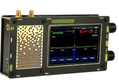
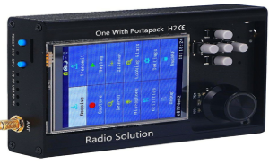
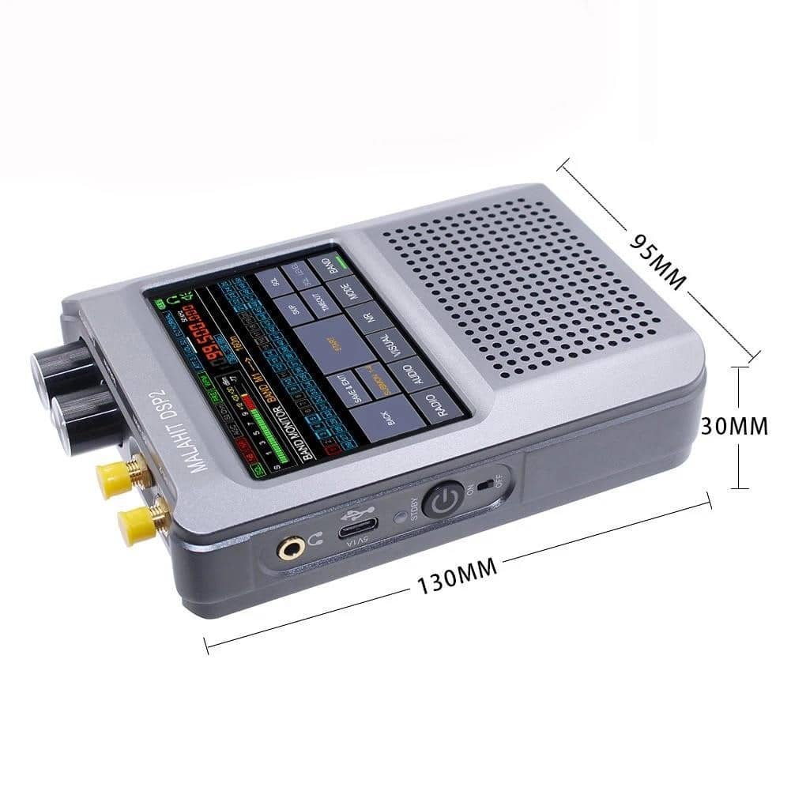

# **Аналітичний огляд існуючих портативних комплексів виявлення та аналізу радіосигналів**

У цьому розділі розглядаються сучасні портативні комплекси для виявлення, аналізу та обробки радіосигналів, що використовуються для моніторингу, тестування та дослідження у сфері радіозв'язку. Особлива увага приділяється програмно-визначуваним радіостанціям (SDR), які забезпечують гнучкість, багатофункціональність та можливість роботи у широкому діапазоні частот.

## Опис технологій

Програмно-визначуване радіо (SDR, Software Defined Radio) — це підхід, при якому більшість функцій традиційного радіоапаратного забезпечення (наприклад, фільтрація, демодуляція, обробка сигналу) реалізується програмно, а не апаратно. Це дозволяє змінювати режими роботи пристрою, підтримувати різні протоколи та стандарти без необхідності заміни апаратної частини. Основні переваги SDR:

- Універсальність — можливість роботи з різними типами сигналів та протоколів.
- Гнучкість — швидка зміна налаштувань, частот, режимів роботи через програмне забезпечення.
- Компактність і портативність — сучасні SDR-пристрої мають невеликі розміри та можуть працювати автономно.
- Масштабованість — можливість оновлення функціоналу шляхом зміни або доповнення програмного забезпечення.
- Широкий спектр застосування — від моніторингу стільникових мереж і аналізу бездротових протоколів до тестування безпеки, наукових досліджень та навчання.

SDR-комплекси дозволяють здійснювати прийом, аналіз, запис, відтворення та передачу радіосигналів у широкому частотному діапазоні, що робить їх незамінними інструментами для фахівців у сфері радіозв'язку, радіоаматорів, дослідників та інженерів.

### Радіостанція Hack RF One Portapack H4 Mayhem SDR 1 МГц – 6 ГГц.

Програмно-визначувана радіостанція HackRF One з додатковим модулем PortaPack H4 та програмним забезпеченням Mayhem – універсальне портативне рішення для роботи, передачі і аналізу радіосигналів в широкому діапазоні частот. Цей пристрій створено на відкритому вихідному коді та володіє великим спектром застосування: моніторинг стільникових мереж, аналіз бездротових протоколів, програмування та експлуатація радіочастот, тестування безпеки бездротових мереж і багато іншого
[HackRF One !](https://fd24.com.ua/ua/p1044872164-sdr-radiostantsiya-antennami.html?source=merchant_center&gad_source=1&gad_campaignid=16695681573&gbraid=0AAAAACqF10_-rY4lJZlaJmtpxI3HFCwSQ&gclid=CjwKCAjw56DBBhAkEiwAaFsG-tMrTVbThssU7Zpa5kQyvDk9m0I4ZMkaidrQvP96XgwxpQHuhkZQ7RoCglAQAvD_BwE).

Оновлений модуль PortaPack H2 додає до функціоналу HackRF One кольоровий сенсорний дисплей, навігаційні кнопки і енкодер для керування. А встановлене програмне забезпечення Mayhem розширює можливості аналізу, експлуатації та тестування бездротових мереж.

На відміну від попередньої версії, H4 володіє покращеним матовим екраном, портом GPIO для додаткових аксесуарів, екранів та датчиків. Також переробленою системою живлення: один перемикач вкл/викл живлення; покращеною архітектурою керування батареєю: швидкою зарядкою через Type-C; відсутністю витоку живлення і розрядки акумулятора.

Вбудований повзунковий перемикач для швидкого перемикання між внутрішнім і зовнішнім мікрофоном/навушниками. Новий вбудований мікрофон дозволить використовувати H4 в якості повноцінного голосового приємопередавача.

Характеристики

* Версія: v2.0.2
* Робота в режимі: напівдуплекс
* Діапазон частот: 1 МГц – 6 ГГц
* Підтримувана частота дискретизації: від 2 до 20 млн семплів в секунду
* Програмно-керуючий смуговий фільтр на прийом і передачу
* Програмно-контрольоване живлення антенного порта (до 50 мА на 3.3 В)
* Сенсорний кольоровий РК-екран з діагоналлю 3.2”
* Вбудований динамік
* Зручні кнопки для програмування
* Роз'єм антени: SMA-мама
* Роз'єм для навушників/мікрофона: 3.5 мм
* Роз'єм GPIO для підключення
* Живлення: вбудований акумулятор, ємністю 2500 мАг
* Матеріал корпусу: АВС-пластик
* Розміри: 8 x 12.5 x 2.5 см

### Радіостанція Libre SDR PLUTO з Zynq 7020 70 МГц – 6 ГГц.

LibreSDR є аналогом популярного SDR-модуля ADALM-PLUTO (або PlutoSDR), який зроблений у металевому корпусі для ефективнішого розсіювання тепла та міцності[LibreSDR !](https://fd24.com.ua/ua/p2465955107-sdr-radiostantsiya-antennami.html).

Пристрій спроєктований на друкованій платі з використанням 8-бітної мікросхеми ЦАП. На самій платі містяться наступні роз'єми:

* два коаксіальні роз'єми MMCX (мама) для інтерфейсів синхронізації 1 PPS і 10 МГц;
* роз'єм RJ-45 для інтерфейсу Gigabit Ethernet, через який відбувається передавання IQ-складників сигналу та доступ у консоль вбудованої ОС Linux;
* два роз'єми Type-C (OTG і Debug):
    * OTG для доступу в консоль вбудованої Linux з послідовного порту
    * Debug для налагодження та завантаження вбудованого ПЗ засобами Xilinx через інтерфейс JTAG
    * обидва роз'єми також використовуються для живлення LibreSDR
* роз'єм MicroSD;
* 4 коаксіальні роз'єми SMA (мама) для двох приймальних і двох передавальних каналів.

Також на пристрої є прихована кнопка DFU для відновлення заводського вбудованого ПЗ. У LibreSDR інтегрований радіочастотний трансивер AD9363.

Характеристики

* Використання чіпа XC7Z020-2CLG400I xc7z020-2I
* Чип AD9363 налаштований на використання чипа AD9361 з діапазоном частот 70 МГц ~ 6 ГГц
* Канали: 2 TX, 2 RX
* Розрядність ЦАП/АЦП: 12 біт
* Діапазон частот: 70 МГц – 6 ГГц
* Вихідна частота: VCTCXO 40 МГц 0.5 стор./хв
* SOC: для Zynq7010 FPGA: 28 Кб
* ОЗП: 512 Mб
* FLASH: 32 Mб
* USB: 2.0, підтримка OTG
* Ethernet: 1000 Mб
* MicroSD можна використовувати для завантаження
* Вхід постійного струму: 5 В, 2 А, MicroUSB
* Підтримка дуплексів: TDD, FDD
* Смуга пропускання: від 200 кГц до 20 МГц
* Матеріал: алюміній
* Розмір: 11.3 х 7.2 х 3 см
* Вага: 565 г

### Радіостанція 1.10D DSP SDR 10 МГц-2 ГГц

[Приймач 1.10D DSP SDR](https://www.joom.com/uk/products/67b2acd0683d8101ba932088?variant_id=67b2acd0683d815eba93208a)
від 10 кГц до 2 ГГц має наступні особливості:

1. Режим демодуляції: Приймач DSP SDR з використанням AM, SSB, NFM, WFM, CW. На основі архітектури SDR, використовуючи передній кінець msi001 RF для 12-бітної кількісної вибірки, використовуючи процесор stm32h743, основна частота до 480 МГц.
2. Чутливість і тривалий термін служби батареї: Цей приймач DSP SDR має частотний діапазон 10 кГц–2,0 ГГц (Зареєстрована версія 1.10d) з s,w 0,3 мікровольт 10 дБ на частоті до 250 МГц. Вбудований акумулятор ємністю 3000мАг забезпечує тривале відтворення.
3. Фільтри: Приймач DSP SDR радіо підтримує подвійний антенний вхід, модуль фільтра загасання переднього кінця, загасання до 30 дБ, високий опір введення, поліпшену короткохвильову чутливість, додати чотири додаткових фронтальних фільтра.
4. Багатофункціональна: Цей короткохвильовий радіоприймач DSP SDR має потужні вбудовані функції зі змінною шириною фільтра, адаптивного шумозаглушувача, порогового шумозаглушувача, шумозаглушувача, AGC, еквалайзера.
5. Підключення до USB: 3,5-дюймовий ємнісний сенсорний екран. Корпус друкованої плати, краща радіочастотна продуктивність, через USB-підключення до комп’ютера, для кота, IQ і звуковий зв’язок може бути реалізований.

Специфікація:

* Тип елемента: приймач DSP SDR
* Матеріал: PCB
* Акумулятор: літій-іонний акумулятор 503450 (Побудований в), Ємність: 3000mAh
* Екран: 3,5-дюймовий IPS ємнісний сенсорний екран
* Демодуляція: AM, SSB, NFM, WFM, CW
* Значення частоти: діапазон від 50 кГц до 49,999 МГц, від 50,001 МГц до 249,999 ГГц, від 400 МГц до 2 ГГц
* MCU: потужний stm32h743 із тактовою частотою 480 МГц.
* Потужні функції: змінна ширина фільтра, адаптивний шумоподавлювач, пороговий шумоподавлювач, шумоподавлювач, AGC, еквалайзер.
* Мікросхема демодуляції: використовуйте повністю функціональну, високоінтегровану та надійну мікросхему msi001.
* Підключено: через USB-з’єднання з комп’ютером, для коду, IQ та звукового зв’язку можна реалізувати.

### Радіостанція Amator SDR  1 МГц - 6 ГГц.

[Радіостанція Amator SDR  1 МГц - 6 ГГц.](https://www.joom.com/uk/products/67ea3b1a35422d011b0f5a93?variant_id=67ea3b1a35422dbc1b0f5a95)
має наступні особливості:

1. 3,5 мм звуковий роз'єм: Цей радіотрансивер використовує 3,5-мм аудіороз'єм, тому, підключивши мікрофон, ви можете просто натиснути та утримувати праву бічну кнопку, щоб здійснити дзвінок.
2. Прийом кількох голосових повідомлень: Цей радіотрансивер підтримує прийом голосу в діапазонах SSB, AM, вузькосмугового FM, широкосмугового FM зі спектральним водоспадом.
3. Спіймати та відтворити: Цей радіоприймач дуже спрощує прийом та відтворення бездротових сигналів з пультів дистанційного керування діапазону ISM.
4. Апаратне забезпечення завершено: Цей радіотрансивер оснащений 3,2-дюймовим резистивним сенсорним екраном, навігаційними перемикачами, радіо-виходами, мікрофонними входами, інтерфейсом DC 2.1 та 4-шаровим позолоченим покриттям.
5. Широке застосування: Цей радіоприймач має широкий спектр застосування та може використовуватися на кораблях, автомобілях, електронних лічильниках комунальних послуг, для моніторингу транспондерів тощо.

Специфікація:

* Тип пристрою: Радіоприймач
* Матеріал: Алюмінієвий сплав
* Тип батареї: Літієва батарея 3,7 В 2000 мАг x1 (Поставляється з вбудованою батареєю)
* Антена прийому частотного діапазону: 1 МГц – 6 ГГц

Зловити повтор:

Одна з найкращих переваг радіотрансивера полягає в тому, що він дозволяє дуже легко вловлювати та відтворювати бездротові сигнали з пультів дистанційного керування діапазону ISM.  
Створіть улов. Все, що вам потрібно зробити, це зайти в меню лову, встановити частоту клавішею пульта дистанційного керування, натиснути червону кнопку запису R та натиснути клавішу на пульті дистанційного керування.  
Потім зупиніть запис, щоб зберегти його на карту пам’яті.  
Тепер ви можете перейти до меню Відтворення, вибрати щойно записаний файл і натиснути кнопку Відтворити. Точно такий же сигнал буде передаватися по повітрю, ефективно замінюючи ваш віддалений ключ.

Приймач:

Ви можете легко прослуховувати стандартні радіосигнали NFM та WFM, підключивши динамік до 3,5-мм радіороз'єму Portapack.  
Прийом ADS B легко вмикається на радіопередавачі, вибравши символ індуктора та блискавки у верхньому правому куті.

Апаратної конфігурації:

* Мікрофон TX
* 3,2-дюймовий, 240 x 320 RGB РК-дисплей з резистивним сенсорним екраном
* Навігаційні перемикачі
* Радіовихід
* Вхід мікрофона
* Роз'єм постійного струму 2.1
* 4-шарове позолота

Функції HAVOC включають:

* Відтворення файлів IQ
* Мікрофонна FM-передача з CTCSS
* Декодер CTCSS
* Частотний менеджер (Збереження та завантаження з карти пам'яті з категоріями та коментарями)
* Файловий менеджер
* Програвач звукових файлів Soundboard Wave (Зберігає 8-бітні монофайли) Карта пам'яті, каталог Wav
* Приймач ADS B з видом карти
* Передавач SSTV
* Повністю налаштовувані сигнали передавача
* Передавач POCSAG
* Приймач, декодер POCSAG
* Передавач Морзе (FM-тон та CW)
* Передавачі OOK для звичайних дистанційних кодерів (PT2262, Дверні дзвінки, Віддалені розетки, Деякі гаражі)
* RDS (Система радіоданих) Передавачі PSN, радіотексту та групового зв'язку за часом
* Приймачі метеорологічних радіоехолотів для M10 та M2K2
* Приймач AFSK
* Передавач АФСК (Дзвінок202)
* Передавач синхронізації Nuoptix DTMF
* Універсальний пульт дистанційного керування TouchTunes Jukebox
* LCR (Language de Commande Routier) Генератор повідомлень
* Передавач управління вуличним освітленням (Тони CCIR)
* Прикидатися мертвим у надзвичайних ситуаціях
* Повністю налаштовуваний генератор радіочастотних сигналів
* Вихід радіо RSSI для висоти тону (для пошуку напрямку)

Особливості:

* 4-сторонні кнопки зі стрілками, колесо прокручування та кнопки вибору
* Батарейка-таблетка для збереження налаштувань, дати й часу
* Слот для мікрокартки пам'яті для зберігання даних та коду
* SSB, AM, вузькосмуговий FM, широкосмуговий FM-радіоприйом з каскадним спектром
* Високошвидкісне підключення (18 МГц) Спектральний та каскадний аналіз
* Моніторинг суден (AIS), автомобілів (TPMS), Транспондери електронних лічильників комунальних послуг (ІТРОН ЕРТ)
* Для режиму запуску прошивки для використання з програмним забезпеченням хоста SDR
* Калібрує PPM для точніших налаштувань
* Режим сну економить енергію, вимикаючи лише дисплей

### Радіостанція Malahit DSP2 SDR Radio Firmware 2.40 Receiver 10 кГц - 2 ГГц.

[Malahit-DSP2 SDR](https://www.joom.com/uk/products/67399c645aa1e901d90ed87c?variant_id=67399c645aa1e9c2d90ed87e)
, оригінальний приймач другого покоління, 10 кГц-380 МГц, 404 МГц-2 ГГц. Найновіша прошивка версії 2.40 абсолютно новий оригінальний приймач Malahit-DSP2.

Основні параметри:

* Діапазон частот: 10 кГц-380 МГц, 404 МГц-2 ГГц.
* Ширина панорами: 192 кГц, 96 кГц, 48 кГц.
* Тип модуляції: AM, SSB, DSB, CW, NFM, WFM.
* Чутливість: 0,3 мкВ до 1 ГГц.
* Динамічна смуга пропускання: 82 дБ.
* Антена: роз'єм SMA з внутрішньою різьбою 50 Ом.
* Режим високого імпедансу (DSP2 або DSP1 з додатковою платою)
* Активна антена Bias Tee (DSP2 або DSP1 з додатковою платою)
* Джерело живлення: літій-іонний акумулятор 5000 мА*г.
* Екран: сенсорний РК-дисплей 3,5 дюйма.
* Характеристики програмного забезпечення
* Адаптивне шумозаглушення (NR)
* Порогове шумозаглушення
* Шумозаглушення (NB)
* Автоматичне регулювання підсилення (AGC)
* Автоматичний режекторний фільтр (ANF)
* Стерео FM підтримує аналогове стерео RDS
* Еквалайзер

Цей радіоприймач має широкий спектр застосування та може використовуватися на кораблях, автомобілях, електронних лічильниках комунальних послуг, для моніторингу транспондерів тощо.
3,5-дюймовий IPS ємнісний сенсорний екран.

## Висновок по розділу 1

У результаті проведеного аналітичного огляду можна зробити висновок, що сучасні портативні комплекси виявлення та аналізу радіосигналів, зокрема програмно-визначувані радіостанції (SDR), є потужними, гнучкими та багатофункціональними інструментами. Їхні можливості значною мірою залежать від реалізованого апаратного забезпечення та програмного забезпечення, що дозволяє адаптувати пристрої до різноманітних сценаріїв використання — від професійного моніторингу радіочастотного спектра до наукових досліджень та аматорських проєктів.

Оглянуті пристрої — Hack RF One з PortaPack H4, Libre SDR PLUTO, 1.10D DSP SDR та Amator SDR — демонструють різні підходи до реалізації SDR-рішень. Вони відрізняються функціональністю, діапазоном частот, інтеграцією інтерфейсів, типами екранів, автономністю та можливостями програмного налаштування. Зокрема, HackRF One з PortaPack H4 виділяється універсальністю і компактністю, LibreSDR — потужним обчислювальним модулем та високою пропускною здатністю, 1.10D DSP SDR — простотою використання та широким функціоналом, а Amator SDR — зручністю роботи з голосовими повідомленнями та аналізом ISM-сигналів.

Таким чином, вибір конкретного комплексу залежить від специфічних завдань користувача, технічних вимог і умов експлуатації. Загалом, розвиток SDR-технологій відкриває нові горизонти у сфері бездротових комунікацій, підвищуючи ефективність, мобільність і функціональність систем радіозв’язку.

