## Підбір елементної бази

Підбір елементної бази — це ключовий етап у розробці будь-якого електронного пристрою, особливо якщо йдеться про складні багатофункціональні системи, такі як польовий планшет для збору, обробки та передачі даних. Від правильного вибору компонентів залежить не лише функціональність, а й надійність, енергоефективність, масштабованість і вартість кінцевого виробу.

Головна мета — забезпечити оптимальне поєднання апаратних компонентів, які відповідають вимогам проєкту за наступними критеріями.

* Функціональність: кожен елемент повинен виконувати свою роль (наприклад, прийом радіосигналу, обробка даних, зберігання інформації, відображення результатів, автономне живлення тощо).
* Сумісність: компоненти мають бути електрично та програмно сумісними між собою, щоб забезпечити стабільну роботу системи.
* Енергоефективність: важливо мінімізувати споживання енергії, особливо для портативних і автономних пристроїв.
* Масштабованість і гнучкість: можливість розширення функціоналу або заміни окремих модулів без повної переробки пристрою.
* Надійність і довговічність: вибір перевірених рішень із хорошою репутацією та підтримкою.
* Вартість і доступність: компоненти повинні бути доступними на ринку, а їх ціна — відповідати бюджету проєкту.

Етапи підбору елементної бази:

1. Аналіз вимог: визначення основних задач пристрою (наприклад, прийом і аналіз радіосигналів, GPS-навігація, відеозахоплення, зберігання даних, відображення інформації, автономна робота).
2. Вибір ключових модулів: підбір основних функціональних блоків (SDR-приймач, центральний процесор, GPS-модуль, накопичувач, дисплей, акумулятор, материнська плата).
3. Порівняння альтернатив: аналіз переваг і недоліків різних варіантів кожного модуля з урахуванням технічних характеристик, сумісності, ціни, підтримки та наявності.
4. Інтеграція: перевірка можливості спільної роботи обраних компонентів, оцінка потреб у додаткових адаптерах, платах розширення, драйверах тощо.
5. Прототипування: складання тестового зразка для перевірки працездатності всієї системи.

Грамотний підбір елементної бази дозволяє наступне.

* Забезпечити стабільну та ефективну роботу пристрою в реальних умовах експлуатації.
* Мінімізувати ризики виникнення апаратних і програмних проблем.
* Спростити подальше обслуговування, ремонт і модернізацію.
* Досягти балансу між продуктивністю, автономністю, розмірами та вартістю.
* Гарантувати масштабованість і адаптивність системи під нові задачі.

У цьому розділі детально розглядаються всі основні компоненти, їхні характеристики, переваги та недоліки, а також обґрунтовується вибір кожного елемента для конкретного застосування. Такий підхід дозволяє створити оптимальну апаратну платформу для реалізації поставлених функціональних і експлуатаційних вимог.

### Антени

Антени — це ключовий елемент системи прийому та передачі радіосигналів, оскільки саме вони забезпечують ефективний зв'язок пристрою з навколишнім радіочастотним середовищем. У контексті польового планшета для збору, обробки та передачі даних антени виконують наступні функції.

* Прийом радіосигналів: антена вловлює електромагнітні хвилі з ефіру та перетворює їх на електричний сигнал, який далі обробляється SDR-приймачем або іншим радіомодулем. Якість прийому залежить від типу антени, її розміру, налаштування та відповідності робочому діапазону частот.
* Передача радіосигналів: при необхідності антена випромінює сформований електричний сигнал у вигляді радіохвиль, забезпечуючи зв'язок із зовнішніми пристроями, мережами або іншими системами.
* Забезпечення оптимальної роботи SDR: для широкосмугових SDR-приймачів важливо мати антену, яка покриває необхідний частотний діапазон і має відповідну діаграму спрямованості (всенаправлену чи спрямовану — залежно від задачі).
* Гнучкість і масштабованість: можливість підключення різних типів антен дозволяє адаптувати пристрій під різні сценарії використання — від моніторингу широкого спектра до точкового прийому слабких або далеких сигналів.
* Зниження рівня шуму та перешкод: правильно підібрана антена зменшує вплив зовнішніх завад, підвищує чутливість системи та покращує якість прийому.

У польових умовах особливо важливо враховувати компактність, міцність, простоту монтажу та можливість швидкої заміни або налаштування антени під конкретні задачі. Вибір типу антени (телескопічна, дипольна, дискон, спрямована, петльова тощо) визначається робочим діапазоном частот, вимогами до дальності зв'язку, рівнем сигналу та специфікою застосування (моніторинг, аналіз, передача даних, геолокація тощо).

Таким чином, антена є невід'ємною частиною апаратної платформи, що безпосередньо впливає на ефективність і функціональність пристрою для прийому та передачі радіосигналів.

[Види антен](https://sprotyvg7.com.ua/wp-content/uploads/2023/05/Osnovni-harakterystyky-anten_ukr.pdf):

1. Телескопічна антена (Whip Antenna).

    * Частотний діапазон: ~30 МГц – 1 ГГц (залежно від довжини)
    * Переваги: регульована довжина, компактність
    * Недоліки: погано працює на частотах нижче 20 МГц або вище 1 ГГц
    * Ідеальна для загального моніторингу, прослуховування FM-радіо, авіадіапазону тощо.

2. Дипольна антена.

    * Частотний діапазон: залежить від довжини плечей (резонансна)
    * Переваги: хороша ефективність на налаштовану частоту
    * Недоліки: потребує місця для встановлення, вузькосмугова
    * Підходить для прийому короткохвильових (HF) та деяких VHF сигналів.

3. Антена Discone.

    * Частотний діапазон: ~25 МГц – 1.3 ГГц
    * Переваги: надширокий діапазон, всенаправлена
    * Недоліки: габаритна, складна у транспортуванні
    * Популярна для загального спектрального аналізу або моніторингу кількох діапазонів.

4. Спрямовані антени (Yagi, Log-periodic).

    * Частотний діапазон: залежить від конструкції
    * Переваги: велике підсилення, вузька діаграма направленості
    * Недоліки: потрібно точно наводити, габарити
    * Використовується для направленого прийому, наприклад, супутникових або цифрових наземних сигналів.

5. Петльова антена (Loop Antenna).

    * Частотний діапазон: від LW до HF
    * Переваги: низький рівень шуму, малий розмір
    * Недоліки: вузькосмугова, потребує підстроювання
    * Чудово підходить для прийому слабких сигналів у діапазоні коротких хвиль.

6. Антена типу "вухо кролика" (Rabbit Ears).

    * Частотний діапазон: 50 – 800 МГц
    * Переваги: дешева, проста
    * Недоліки: неефективна поза телевізійними діапазонами
    * Може використовуватись для прийому DVB-T, FM або експериментів.

### Радіо модуль

Приймач призначений для прийому  електромагнітних коливань. Базовий принцип роботи радіостанцій під час отримання сигналу можна описати такою схемою. Електромагнітні коливання вловлюються антеною і перетворюються на електричний сигнал. Прийнятий радіосигнал з антени  посилюється за допомогою підсилювача завдяки підвищенню потужності. Радіохвиля обробляється демодулятором і перетворюється на вихідні дані. У цьому полягає принцип прийняття радіосигналу. Завдяки мікротехнологіям виготовлення плат із мікросхемами та окремими мікро-деталями, на сьогодні у пристроях SDR використовуються більш функціональніші можливості, що перетворює блок прийому сигналу у повноцінний приймач-відтворювач. Тому вихідні дані сигналу обробляються ПЗ і відповідно подаються у вигляді сигналів для формування зображень та звуку на моніторі чи у гучномовцю.

1. HackRF-One

[HackRF-One](https://github.com/dodgymike/hackrf-wiki/blob/master/HackRF-One.md)
— це програмоване радіо, що дозволяє працювати з широким діапазоном частот (від 1 MHz до 6 GHz). Цей пристрій є потужним інструментом для досліджень і застосувань у бездротових комунікаціях, криптографії, виявленні та аналізі радіосигналів.

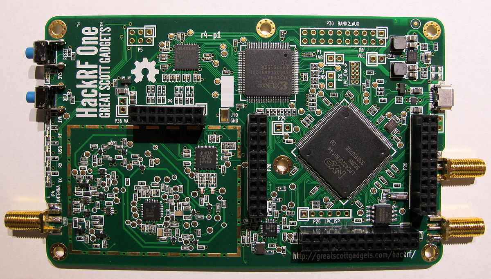

Переваги.

* Широкий діапазон частот: підтримка від 1 MHz до 6 GHz дозволяє працювати з практично всіма радіочастотними спектрами.
* Програмування: можливість налаштовувати частоти і параметри роботи за допомогою відкритого програмного забезпечення.
* Мобільність: HackRF-One має компактний розмір, що дозволяє використовувати його у польових умовах.

Недоліки.

* Потребує спеціалізованих знань: використання потребує знань у галузі радіоелектроніки та програмування.
* Обмежена потужність: HackRF-One не підходить для високоякісних і далекобійних передавальних пристроїв.

2. RTL-SDR v3

[RTL-SDR](https://www.rtl-sdr.com/buy-rtl-sdr-dvb-t-dongles/)
 — це недорогий USB-приймач SDR, побудований на базі RTL2832U. Хоча він не підтримує передавання сигналів, його можна використовувати для широкого спектру задач моніторингу — від аналізу спектру до прийому супутникових або авіаційних сигналів.

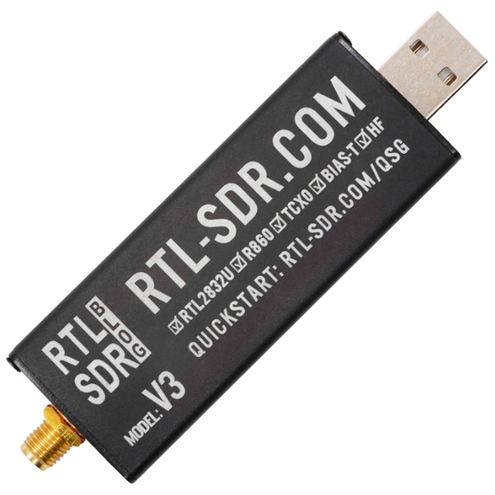

Переваги:

* Дуже низька вартість — ідеально підходить для початківців.
* Покриває частоти від 500 kHz (через модифікацію) до 1.7 GHz.
* Працює з популярними програмами, такими як SDR#, GQRX, GNURadio.

Недоліки:

* Тільки приймач — неможливо передавати сигнали.
* Вужчий діапазон частот порівняно з HackRF.
* Нижча точність та динамічний діапазон.

3. LimeSDR Mini v2

[LimeSDR Mini](https://limemicro.com/products/boards/limesdr-mini/)
 — це компактний SDR із повною підтримкою прийому та передачі сигналів. Працює в діапазоні від 10 MHz до 3.5 GHz та підтримує USB 3.0 для високої швидкості передачі даних. Відмінно підходить для мобільних проєктів з аналізу та трансляції сигналів.

Переваги:

* Повноцінна підтримка TX/RX.
* Вища якість сигналу, ніж у HackRF, особливо при цифровій модуляції.
* Відкрите ПЗ та активна спільнота.

Недоліки:

* Вужчий частотний діапазон: до 3.5 GHz проти 6 GHz у HackRF-One.
* Дорожчий, ніж RTL-SDR, і трохи складніший у використанні.

4. [ADALM-Pluto (PlutoSDR)](https://wiki.analog.com/university/tools/pluto)

PlutoSDR від Analog Devices — це потужна SDR-платформа з підтримкою прийому і передачі в діапазоні 325 MHz – 3.8 GHz (можна розширити до 70 MHz – 6 GHz через прошивку). Використовується в освітніх та наукових цілях, з дуже якісною документацією та підтримкою від виробника.

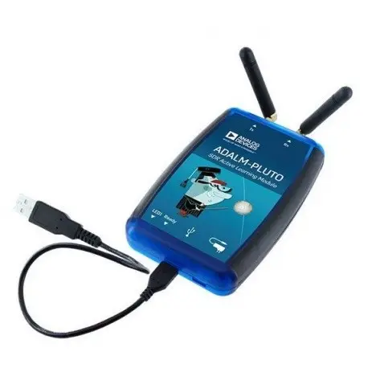

Переваги:

* Надійна апаратна реалізація від Analog Devices.
* TX/RX з хорошим рівнем чистоти спектру.
* Можливість розширення частотного діапазону програмно.

Недоліки:

* Складніше у налаштуванні для новачків.
* Менш компактний форм-фактор, ніж у HackRF-One.

5. BladeRF 2.0 micro xA4 SDR трансівер 47 МГц-6 ГГц 49 КЛЕ ПЛІС

[BladeRF](https://selteq.com.ua/ru/bladerf-2-0/) 
— це SDR-пристрій нового покоління, який охоплює частотний діапазон від 47 МГц до 6 ГГц, підтримує частоту дискретизації 61,44 МГц (з можливістю підвищення до 122,88 МГц) і забезпечує потокову обробку сигналів у режимі 2×2 MIMO. bladeRF ідеально підходить для мобільних та високопродуктивних застосувань.

Металевий екран забезпечує захист чутливих радіочастотних елементів від електромагнітних завад (EMI) і покращує тепловідведення, що дозволяє bladeRFстабільно працювати навіть у складних умовах.

Усі SMA-порти для радіочастотних сигналів можуть подавати живлення на широкосмугові або попередні підсилювачі через схему інжекції струму. Керування живленням периферійних пристроїв здійснюється програмно, що забезпечує максимальну гнучкість у використанні.

Основою bladeRF 2.0 є сучасна ПЛІС Cyclone V від Intel (раніше Altera). У моделі xA4 використовується ПЛІС із 49 тисячами логічних елементів.

Розширена система синхронізації дозволяє bladeRF як приймати, так і передавати тактовий сигнал із частотою 38,4 МГц. Вбудована схема ФАПЧ дає змогу синхронізувати внутрішній генератор із зовнішньою опорною частотою 10 МГц. У xA4 застосовується високоточний стабільний генератор, а вбудований ЦАП дозволяє точно підлаштовувати частоту для заводського калібрування.

Система живлення bladeRFскладається з поєднання малошумних імпульсних і лінійних стабілізаторів. Пристрій може працювати лише від USB, але для максимальної лінійності периферійних пристроїв, що живляться через інжектор, рекомендується підключати зовнішнє джерело живлення. Схема автоматичного перемикання дозволяє оптимізувати споживання енергії між USB і зовнішнім живленням.

Модуль bladeRF 2.0 micro підтримує автономний режим роботи без підключення до комп’ютера чи контролера. Обсяг вбудованої флеш-пам’яті достатній для зберігання будь-якого образу ПЛІС xA4.

Можливості та функціонал.

* РЧ-ПАРАМЕТРИ.
    * Робочий частотний діапазон: 47 МГц – 6 ГГц.
    * Підтримка 2 × 2 MIMO.
    * Частота семплювання: 61,44 МГц.
    * Максимальна ширина смуги ПЧ: до 56 МГц.
    * Автоматичне керування підсиленням (AGC).
    * Автоматичне вирівнювання IQ та компенсація постійної складової.

* ПІДТРИМКА ВИСОКОШВИДКІСНОГО ІНТЕРФЕЙСУ USB 3.0.
    * ARM926EJ-S процесор із тактовою частотою 200 МГц.
    * Повноцінне живлення через USB 3.0.
    * Можливість підключення зовнішнього джерела 5 В з автоматичним перемиканням.

* FPGA ALTERA CYCLONE V.
    * 49 тисяч логічних елементів для обробки сигналів та апаратного прискорення.

* VCTCXO ЗАВОДСЬКОГО НАЛАШТУВАННЯ.
    * Керування ФАПЧ через 12-розрядний ЦАП.
    * Точне заводське калібрування генератора 38,4 МГц.

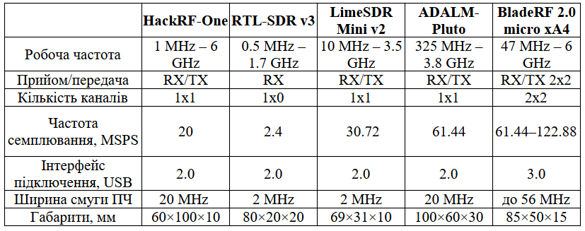

Висновок

BladeRF  — це найкращий вибір для пристрою захоплення радіосигналу завдяки поєднанню широкого частотного діапазону (47 МГц – 6 ГГц), підтримки повноцінного прийому та передачі (2×2 MIMO), високої якості сигналу та сучасної елементної бази (FPGA Cyclone V, USB 3.0). BladeRF забезпечує більшу гнучкість у налаштуванні, стабільну роботу навіть у складних умовах, а також підтримку професійних інтерфейсів і програмного забезпечення (GNURadio, SDR#, SoapySDR тощо). Завдяки екрануванню, можливості автономної роботи, розширеним функціям живлення та високій точності синхронізації, bladeRF деально підходить для мобільних і польових рішень, де важливі надійність, продуктивність і масштабованість. У порівнянні з іншими SDR-пристроями, він пропонує оптимальний баланс між функціональністю, якістю та можливістю розширення, що робить його найкращим вибором для даного проєкту.

### Обчислювальний модуль

Центральне ядро обчислень є мозком будь-якого сучасного електронного пристрою. Саме цей компонент відповідає за обробку даних, виконання програмного забезпечення, взаємодію з периферією та забезпечення загальної продуктивності системи. Вибір обчислювального модуля визначає можливості пристрою щодо швидкості роботи, підтримки сучасних інтерфейсів, енергоефективності та масштабованості. У цьому підрозділі розглядаються основні варіанти центральних обчислювальних платформ, їхні характеристики, переваги та недоліки для побудови польового планшета.

1. Raspberry Pi Compute Module 5

[Raspberry Pi Compute Module 5 (CM5)](https://www.raspberrypi.com/products/compute-module-5)
— це компактний та потужний комп'ютер на базі процесора Broadcom BCM2711, який використовується в різноманітних вбудованих системах. Це основний компонент, який виконує обчислювальні операції у проекті. CM4 пропонує широку гнучкість завдяки варіативності в обсягах пам'яті (від 1 ГБ до 8 ГБ) і можливості додаткового зберігання через eMMC або microSD картки.

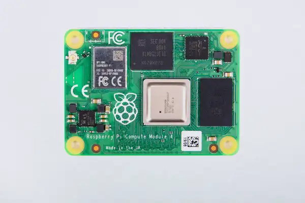

Переваги.

* Висока потужність: чотириядерний процесор Cortex-A72 дозволяє запускати інтенсивні додатки, зокрема обробку відео та даних у реальному часі.
* Гнучкість: доступні варіанти з різними об'ємами пам'яті та зберігання.
* Широка підтримка периферії: можливість підключення різноманітних пристроїв через GPIO, HDMI, USB, Ethernet, а також підтримка стандартних Raspberry Pi HAT.
* Підтримка бездротового зв'язку: вбудовані модулі Wi-Fi та Bluetooth дозволяють організувати мобільний зв'язок і передачу даних без дротів.

Недоліки.

* Високі вимоги до живлення: потребує постійного підключення до джерела живлення, що може бути проблемою в автономних рішеннях.
* Відсутність вбудованого монітора: необхідно підключати зовнішній дисплей.
* Обмеження за типами зберігання: відсутність стандартного жорсткого диска обмежує швидкість зберігання даних при великих об'ємах.

2. NVIDIA Jetson Nano

[NVIDIA Jetson Nano](https://developer.nvidia.com/embedded/jetson-nano)
— це мікрокомп'ютер, орієнтований на проекти з використанням штучного інтелекту. Він оснащений чотириядерним ARM Cortex-A57 процесором та графічним процесором NVIDIA Maxwell із 128 ядрами CUDA, що робить його ідеальним для задач комп'ютерного зору, машинного навчання та автономних систем.

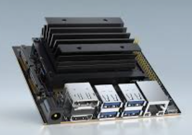

Переваги:

* Потужний GPU: підтримує глибоке навчання, AI, відеоаналітику в реальному часі.
* Висока продуктивність у AI-завданнях: оптимізований під TensorFlow, PyTorch, OpenCV.
* Підтримка дисплеїв через HDMI та MIPI DSI, а також камер через CSI.

Недоліки:

* Високе енергоспоживання, що не ідеально для автономних рішень.
* Обмежена спільнота у порівнянні з Raspberry Pi.
* Потребує активного охолодження при тривалому навантаженні.

3. Radxa CM3

[Radxa CM3](https://wiki.radxa.com/CM3) — це сумісний за розмірами модуль з Raspberry Pi CM4, але базується на SoC Rockchip RK3566 (4x Cortex-A55 до 2.0 ГГц) і орієнтований на вбудовані та мультимедійні рішення. Він підтримує до 8 ГБ LPDDR4 RAM і до 128 ГБ eMMC.

Переваги:

* Висока енергоефективність: Cortex-A55 забезпечує хорошу продуктивність при низькому споживанні енергії.
* Розширені можливості відео: підтримка 4K відео, кодеків H.265/H.264.
* Повна сумісність по роз'єму з Raspberry Pi CM4.

Недоліки:

* Менш розвинена екосистема (менше доступного ПЗ, менше підтримки спільноти).
* Підтримка Linux дещо обмежена в порівнянні з Raspberry Pi OS.
* Немає вбудованого Wi-Fi/Bluetooth у базовій конфігурації.

<!-- 4. Banana Pi BPI-CM4

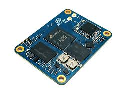

[Banana Pi BPI-CM4](https://wiki.banana-pi.org/Banana_Pi_BPI-CM4)
— ще один сумісний із Raspberry Pi Compute Module 5 варіант, який використовує Rockchip RK3568 (4x Cortex-A55). Він орієнтований на промислові рішення, що потребують високої стабільності та надійності.

Переваги:

* Великий набір інтерфейсів: SATA, PCIe, USB 3.0, MIPI DSI/CSI.
* Підтримка eMMC до 128 ГБ, до 8 ГБ RAM.
* Хороша термостійкість і надійність — придатний для польових умов.

Недоліки:

* Не настільки добре підтримується спільнотою, як Raspberry Pi.
* Відсутність офіційної підтримки деяких популярних дистрибутивів Linux.
* Деякі користувачі відзначають нестабільність програмного забезпечення. -->

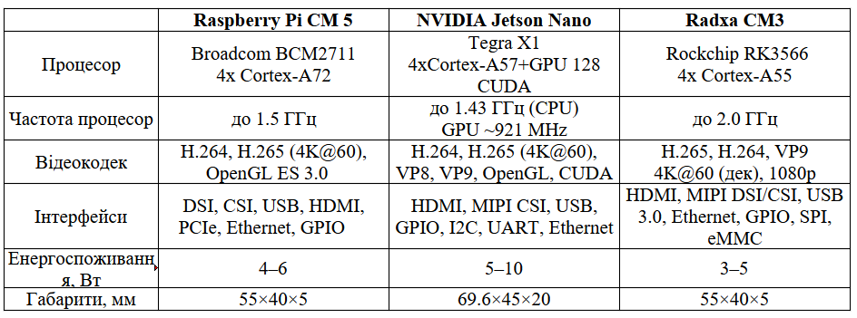

Висновок

Попри наявність конкурентів, Raspberry Pi Compute Module 5 залишається найкращим вибором для через баланс між продуктивністю, гнучкістю, широкою підтримкою та стабільністю. Його багаторічна репутація, величезна спільнота користувачів, сумісність з великою кількістю периферійних модулів і чудова документація роблять його ідеальним ядром для проєктів, де важливі стабільність, підтримка і масштабованість.

<!-- ### Пристрій захоплення аналогового відеосигналу

1. USB карта відеозахоплення LUX EasyCap

EasyCap — це бюджетний USB-адаптер для захоплення відеосигналу з аналогових джерел, таких як камери, DVD-плеєри чи ігрові консолі. Він підтримує передачу відео і аудіо через USB, що робить його універсальним рішенням для запису відео та моніторингу.

Переваги:

* Низька ціна: один із найекономніших варіантів для відеозахоплення.
* Легкість у використанні: підключається через USB і сумісний з більшістю операційних систем.
* Універсальність: можна використовувати з різними аналоговими джерелами відео.

Недоліки:

* Обмеження якості: відео може бути обмежене в роздільній здатності та якості порівняно з сучасними цифровими рішеннями.

2. Digitnow USB 2.0 Video Capture Card

[Digitnow USB 2.0 Video Capture Card](https://www.amazon.com/Digitnow-Video-Capture-Converter-VHS/dp/B01HEQZ66U)
це пристрій, що є повним аналогом EasyCap, але має покращений чипсет і часто постачається з власним ПЗ для захоплення відео. Призначений для роботи з аналоговими джерелами через композитні та S-Video входи.

Переваги:

* Покращена сумісність з Windows 10 і 11.
* Часто має краще ПЗ для редагування/запису відео в комплекті.
* Легке підключення через USB.

Недоліки:

* Все ще обмежена якість відео (SD, 720x576 max).
* Більш висока ціна порівняно з EasyCap без суттєвих переваг.

#### [August VGB100 USB Video Capture Stick](https://www.augustint.com/uk/productmsg-103-0.html)

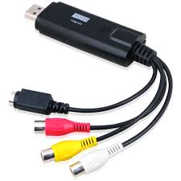

August VGB100 — це більш преміальний адаптер з підвищеною стабільністю з'єднання, кращим чипсетом і зменшеним шумом у відео. Ідеально підходить для захоплення відео з аналогових камер у реальному часі.

Переваги:

* Вища якість відео у порівнянні з бюджетними рішеннями.
* Менше артефактів та шуму при записі.
* USB 2.0 сумісність та підтримка PAL/NTSC.

Недоліки:

* Вартість значно вища за EasyCap.
* Все ще обмежений до SD-якості. 

Висновок

LUX EasyCap забезпечує оптимальне співвідношення ціни та функціональності для задач захоплення аналогового відео в DIY-проєкті. Попри скромну якість відео (яка характерна для всіх адаптерів цього класу), він легкий у використанні, доступний, сумісний з Linux/Windows, і не потребує складного налаштування. У контексті польового планшета, де важлива мобільність, економія енергії та простота, LUX EasyCap стає ідеальним бюджетним вибором для роботи з аналоговими камерами або відеосигналами. -->

### GPS модуль

У сучасних портативних пристроях модуль GPS є невід’ємною складовою для визначення місцезнаходження, синхронізації часу та навігації. Вибір відповідного GPS-модуля впливає на точність позиціювання, швидкість отримання координат і стабільність роботи в різних умовах. У цьому підрозділі розглядаються основні типи GPS-модулів, їхні характеристики, переваги та недоліки для інтеграції у польовий планшет.

1. GPS модуль NEO-6M
  
[GPS модуль u-blox NEO-6M](https://uamper.com/products/datasheet/NEO-6.pdf)
забезпечує точне визначення географічних координат і може використовуватися для синхронізації часу або визначення місця розташування. Він є важливим компонентом для проектів, де необхідно точно визначати позицію детекованого сигналу, наприклад, у системах моніторингу або геолокації.

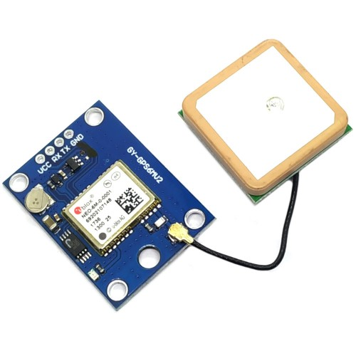

Переваги.

* Висока точність: забезпечує точність до кількох метрів, що ідеально підходить для геолокаційних задач.  
* Швидкий старт: підтримує функцію швидкого холодного та гарячого старту для швидкого визначення координат.  
* Низьке енергоспоживання: оптимізований для роботи в енергоефективних системах.  
* Широка сумісність: підтримує стандартні інтерфейси UART і I2C, що дозволяє легко інтегрувати модуль у різні системи.  

Недоліки.

* Залежність від сигналу: потребує відкритого доступу до неба для отримання точних координат.  
* Додаткові антени: для покращення прийому сигналу може знадобитися зовнішня антена.  

2. u-blox NEO-M8N

NEO-M8N — більш сучасна модель від u-blox з розширеною функціональністю. Підтримує одразу декілька навігаційних систем (GPS, GLONASS, Galileo), що значно підвищує точність і надійність у складних умовах.

Переваги.

* Підтримка кількох GNSS систем.
* Вища точність і стабільність у міських або лісистих місцевостях.
* Висока швидкість оновлення (до 10 Гц).

Недоліки.

* Вища ціна.
* Потребує якіснішої антени для досягнення повної продуктивності.

3. Quectel L86 GPS/GNSS модуль

L86 — компактний GNSS модуль із вбудованою патч-антеною. Підтримує GPS, QZSS і SBAS. Має вбудовану флеш-пам’ять для збереження даних та швидкого старту.

Переваги:

* Надзвичайно компактний форм-фактор.
* Вбудована антена — не потребує зовнішньої (але можна підключити).
* Підтримка AGPS (завантаження ефемерид через інтернет).

Недоліки:

* Нижча чутливість у порівнянні з модулями з повноцінною антеною.
* Вужчий діапазон GNSS протоколів, ніж у M8N.

<!-- #### Beitian BN-220

BN-220 — це готовий до використання GPS-модуль у пластиковому корпусі з вбудованою керамічною антеною. Він особливо популярний у дронах та автономних роботах.

Переваги:

* Просте підключення (UART, plug-n-play).
* Надійний прийом сигналу.
* Вбудована антена з хорошими характеристиками.

Недоліки:

* Менше можливостей кастомізації, ніж у NEO-серії.
* Складніше інтегрувати у тонкий корпус планшета через корпус модуля. -->

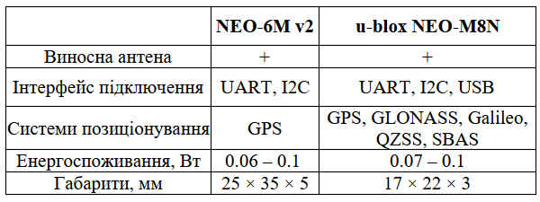

Висновок

NEO-6M v2 — це перевірене, надійне та доступне рішення для проєктів, де важлива точність позиціювання та простота інтеграції. Він має відкриту документацію, велику спільноту підтримки, добре працює з Raspberry Pi, Arduino і STM32, а також легко підключається до зовнішньої активної антени. На відміну від новіших моделей (M8N, L86), NEO-6M не потребує додаткового програмного налаштування, що робить його найкращим варіантом для прототипів і польових DIY-рішень із фокусом на стабільну роботу та простоту.

### Пам'ть постійного зберігання

Пам'ять постійного зберігання є критичним компонентом будь-якого сучасного електронного пристрою, оскільки саме вона відповідає за збереження операційної системи, програмного забезпечення та користувацьких даних. Від вибору типу та моделі накопичувача залежать швидкість роботи системи, надійність зберігання інформації, енергоефективність і загальна стабільність пристрою. У цьому підрозділі розглядаються основні варіанти SSD-накопичувачів, їхні характеристики, переваги та недоліки для використання у складі польового планшета.

1. SSD диск Transcend MTS420S 240GB M.2 2242 SATAIII 3D NAND TLC

[SSD MTS420S](https://hard.rozetka.com.ua/ua/transcend-ts240gmts420s/p436737317/)
диск забезпечує високу швидкість читання та запису завдяки використанню 3D NAND технології та інтерфейсу SATAIII. Ідеальний для зберігання операційної системи, даних та програм у вашому пристрої.

Переваги:

* Висока швидкість: забезпечує швидке завантаження та збереження даних.
* Надійність: 3D NAND пам'ять є більш стійкою до зносу, ніж традиційна 2D NAND.
* Енергоефективність: знижене споживання енергії в порівнянні з механічними жорсткими дисками.

Недоліки:

* Ціна: хоча ціни на SSD знижуються, вони все ще дорожчі, ніж звичайні жорсткі диски.
* Обмежена ємність: хоча 240 ГБ — достатньо для стандартних задач, для великих даних знадобиться диск більшої ємності.

2. KingSpec M.2 2242 SATAIII 256GB

KingSpec — китайський виробник SSD-дисків, який пропонує бюджетні рішення з форм-фактором M.2 2242. Цей SSD має інтерфейс SATAIII і базується на TLC NAND, що забезпечує швидкий доступ до даних.

Переваги:

* Вигідна ціна.
* Продуктивність на рівні більшості SATAIII SSD.
* Широка доступність на AliExpress та локальних ринках.

Недоліки:

* Менша надійність і тривалість служби у порівнянні з брендовими рішеннями.
* Часті варіації якості між партіями.

3. ADATA SU650 M.2 2280 SATAIII 240GB

ADATA — відомий виробник із більш стабільною якістю продукції. SU650 — це SATA SSD, який має трохи більший форм-фактор (2280), але може використовуватись у 2242 слотах із адаптером або вільним місцем на платі.

Переваги:

* Стабільна якість і хороша підтримка бренду.
* Надійність в роботі навіть при підвищених навантаженнях.
* Добре підходить для Linux- або Android-платформ.

Недоліки:

* Форм-фактор 2280 — не підходить для компактних систем без адаптера.
* Немає високих швидкостей як у NVMe SSD.

<!-- #### Transcend MTS430S 256GB M.2 2242 SATAIII

Оновлена версія MTS420S, цей диск має вищу ємність (256 ГБ), покращену продуктивність і той самий компактний форм-фактор M.2 2242. Оснащений 3D NAND TLC і підтримує DevSleep для зниженого енергоспоживання.

Переваги:

* Офіційна підтримка Transcend.
* Енергоефективний і довговічний.
* Швидкість читання до 560 МБ/с.

Недоліки:

* Трохи дорожчий, ніж MTS420S.
* Різниця в продуктивності не завжди помітна в реальному використанні. -->

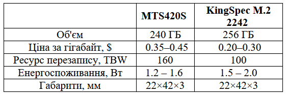

Висновок

Transcend MTS420S забезпечує ідеальний баланс розміру (2242), швидкості, енергоефективності та надійності. У порівнянні з KingSpec, він має значно вищу якість збірки і стабільність роботи, а на відміну від рішень формату 2280 (як ADATA SU650), легко інтегрується в компактні проєкти, зокрема планшети. Крім того, підтримка 3D NAND TLC гарантує довший термін служби без шкоди для продуктивності. Це робить Transcend MTS420S найкращим вибором для польових і DIY-рішень, де важливі компактність, надійність та витривалість.

### Сенсорний дисплей

Сенсорний дисплей є одним із ключових елементів сучасних портативних пристроїв, оскільки саме він забезпечує основний інтерфейс взаємодії користувача з системою. Від вибору типу, розміру, роздільної здатності та технології сенсорного введення залежить зручність експлуатації, функціональність і ергономіка пристрою. У цьому підрозділі розглядаються основні варіанти сенсорних дисплеїв, їхні характеристики, переваги та недоліки для інтеграції у польовий планшет, а також обґрунтовується вибір оптимального рішення для конкретних задач проєкту.

1. Сенсорний дисплей IBM Lenovo Wacom 12.1in XGA LCD Touch Screen

[IBM Lenovo Wacom 12.1in](https://www.alancomputech.com/ibm-lenovo-wacom-12-1in-xga-lcd-touch-screen-13n7241-laptop-su5r-12s05as-02x-13n7241.html) 
цей сенсорний дисплей має XGA роздільну здатність (1024x768 пікселів) і підтримує технологію стилусного введення. Його можна використовувати для розробки інтерфейсів користувача, де необхідний високий рівень точності введення. Використання стилуса дозволяє отримати більш точні результати, що важливо в польових умовах або при роботі з картами та іншими детальними графіками.

Переваги:

* Сенсорне введення: підтримує ввід як пальцем, так і стилусом, що є важливим для інтерактивних додатків.
* Висока точність: точність введення за допомогою стилуса дозволяє використовувати дисплей у складних робочих умовах.
* Компактність і зручність: зручний розмір для портативних рішень.

Недоліки:

* Малий розмір екрана: може бути недостатньо великим для відображення складних графічних інтерфейсів.
* Вартість: дисплей високої якості може бути дорожчим порівняно з іншими дисплеями.

2. Waveshare 10.1" HDMI LCD with Capacitive Touch

[Waveshare 10.1"](https://www.waveshare.com/10.1inch-hdmi-lcd.htm)
це 10.1-дюймовий дисплей із роздільною здатністю 1280x800 пікселів підтримує ємнісне сенсорне введення до 10 дотиків одночасно. Він підключається через HDMI для відео і через USB для сенсорного інтерфейсу, що робить його простим у використанні з Raspberry Pi Compute Module 5.

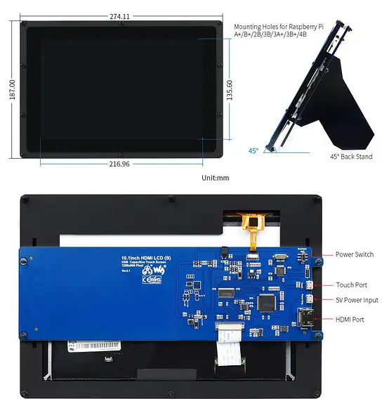

Переваги:

* Вища роздільна здатність, ніж XGA — зручніше для сучасних UI.
* Ємнісний multitouch: підтримка до 10 торкань, плавна взаємодія.
* Просте підключення (HDMI + USB), без складного налаштування драйверів.

Недоліки:

* Не підтримує стилус з точністю Wacom.
* Не має MIPI-інтерфейсу — потребує HDMI, що не завжди зручно в планшетах.

3. Official Raspberry Pi 7" Touchscreen Display

[RPi 7" Touchscreen Display](https://www.raspberrypi.com/products/raspberry-pi-touch-display/)
має роздільну здатність 800x480 та підтримує ємнісний multitouch. Підключається через DSI-інтерфейс, тому не займає HDMI-порт, що критично у компактних системах.

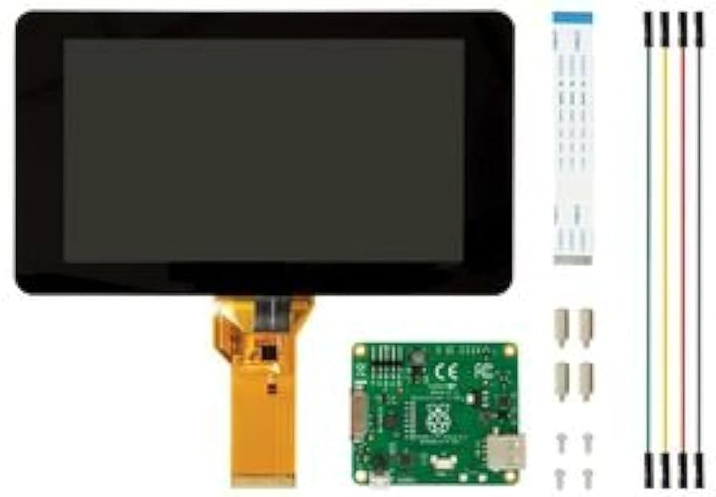

Переваги:

* DSI-підключення: не займає HDMI, що залишає порт для додаткового дисплея або інших задач.
* Компактний: ідеально підходить для невеликих корпусів планшету.
* Хороша інтеграція з Raspberry Pi: драйвери та підтримка з коробки.

Недоліки:

* Низька роздільна здатність (800x480) — обмеження при роботі з великими UI.
* Малий розмір — не завжди зручно для складних інтерфейсів.

<!-- #### [BOE 10.1" MIPI DSI IPS LCD Touch Screen](https://www.panelook.com/TV101WXM-NH0_BOE_10.1_LCM_overview_26806.html)

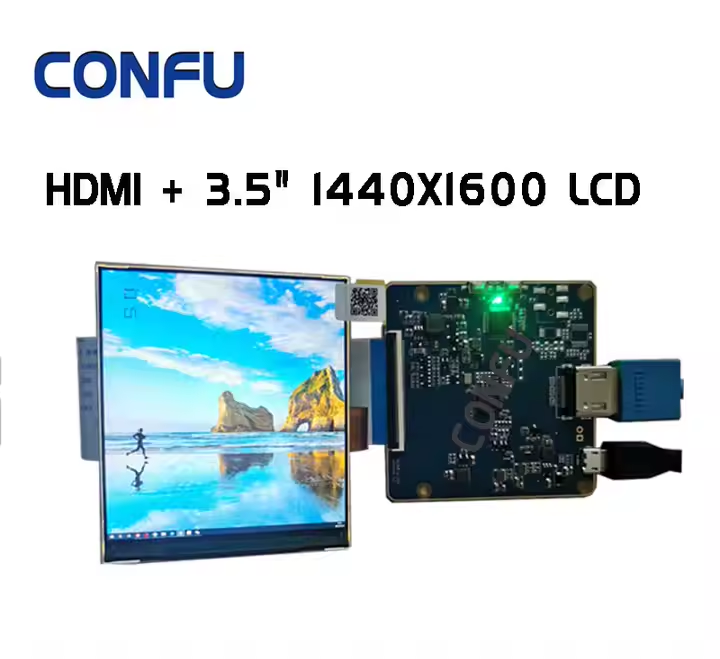

Цей дисплей з IPS-матрицею має роздільну здатність 1280x800 або 1920x1200, підтримує інтерфейс MIPI DSI і часто використовується у промислових планшетах. Підтримує ємнісне сенсорне введення, є моделі з підтримкою стилуса (пасивного або активного).

Переваги:

* Повна підтримка MIPI DSI — без потреби у HDMI, що критично для CM4.
* Висока роздільна здатність, широкі кути огляду (IPS).
* Опціонально — підтримка стилуса або перо.

Недоліки:

* Потребує контролера або виводу з CM4 через DSI-конектор (іноді складне підключення).
* Немає стандартизованої підтримки — залежить від конкретної моделі. -->

Висновок

Цей дисплей виділяється завдяки підтримці активного стилуса з технологією Wacom, що забезпечує високу точність введення, критичну для військових або інженерних додатків, картографії та роботи в складних умовах. Його співвідношення сторін (4:3) зручно для читання технічної документації та створення інтерфейсів, орієнтованих на точність, а не на розваги. Крім того, його корпус і призначення дозволяють використовувати дисплей у надійних польових рішеннях, що робить його кращим варіантом серед альтернатив.

### Модуль живлення

Літій-іонні (Li-ion) елементи та зібрані із них акумуляторні батареї (АБ) за останні роки повністю довели свою ефективність використання у різноманітних галузях людського виробництва техніки та майже замінили кислотні (КБ) і лужні (ЛБ) батареї, котрі використовувалися раніше. А деякі виробництва пристроїв загалом неможливі без новітніх Li-ion джерел струму. Так більшість переносних засобів комунікації (смартфонів), портативних комп'ютерів (ноутбуків, планшетів), засобів руху (моноколіс, GyroScooter, Hoverboard, е-байків), різноманітних побутових та складських роботів (роботів-пилосмоків, роботів для миття вікон), різних портативних та виробничих електростанцій (powerbank, UPS, сонячних станцій) та інших сучасних гаджетів обов’язково створені на основі Li-ion АБ.

Переваги такої технології виробництва над технологіями свинцево-кислотних та лужних (alkaline) хімічних елементів живлення сьогодні стали нормою і базою для створення сучасної техніки у світі. Необхідно відзначити найбільш вагомі особливості Li-ion джерел живлення.

* Щільність енергії на одиницю маси та об’єму — розміри елементів і АБ у 2–4 рази менші.
* Швидка перезарядка від 0 до 100% за 1–2 години, що дає більш ефективно використовувати пристрої на Li-ion живленні.
* Циклічність заряду/розряду від 1000 до 8000 разів, що дозволяє експлуатувати батареї у декілька разів довше: від 5 до 25 років.
* Низький саморозряд — енергія у таких батареях зберігається у декілька разів довше без експлуатації.
* Екологічність — відсутність у будові токсичних металів (кадмій, свинець, ртуть) згідно сучасних екологічних стандартів.

Конструкція та принцип роботи Li-ion акумуляторів

Основу конструкції Li-ion акумуляторів складають.

* Анод — пористий вуглець на мідній підкладці.
* Катод — оксид літію на алюмінієвій фользі.
* Сепаратор — пористий поліпропілен, просочений електролітом, який забезпечує іонну провідність.
* Корпус — герметичний, з під’єднаними до струмознімачів електродами; у деяких моделях є клапан для скидання надлишкового тиску.

Мідні та алюмінієві стрічки, просочені електролітом і розділені сепаратором, згортають у спіраль (для циліндричних корпусів) або укладають шарами (для призматичних чи пакетних форм).

Принцип роботи.

* Під час заряджання позитивно заряджені іони літію відокремлюються від оксиду та мігрують до вуглецевого анода, супроводжуючись окисно-відновною реакцією та накопиченням заряду.
* При розряді процес відбувається у зворотному напрямку — іони Li⁺ повертаються до катода з оксиду літію.

Літієві акумулятори чутливі до надлишкового заряду: перевищення допустимого рівня призводить до осадження металевого літію на аноді, що може спричинити реакцію з електролітом. У такому разі на катоді інтенсивно виділяється кисень, що проявляється нагріванням, підвищенням тиску та ризиком розгерметизації елемента.

Процес заряджання літієвих елементів та акумуляторних батарей відбувається у два основних етапи.

1. Перший етап — заряджання здійснюється при постійному струмі 0,2С–1С до досягнення напруги 4,2 В, що зазвичай триває близько 40 хвилин.
2. Другий етап — заряджання продовжується при фіксованій напрузі, доки зарядний струм не зменшиться до 3% від номінального значення.

Для подовження терміну служби літієвої батареї рекомендується заряджати її струмом, який дорівнює 50% від ємності (0,5С).

З часом Li-ion акумулятори «старіють»: усередині накопичуються продукти окислення, а ємність поступово зменшується. Економічно виправдано вважати акумулятор таким, що відпрацював свій ресурс, коли його ємність знижується на 30% від початкової. Типовий ресурс таких батарей — близько 1000 циклів заряджання та розряджання.

Щоб подовжити термін служби АКБ, рекомендується наступне.

* Не перевищувати оптимальний зарядний струм (0,5С, тобто 50% від номінальної ємності).
* Уникати глибокого розряду та перезаряджання.
* Не допускати перегріву, переохолодження та тривалого зберігання у розрядженому стані.

Дотримання цих рекомендацій дозволяє зберегти максимальну ефективність та надійність акумулятора протягом усього періоду експлуатації.

Типи та різновиди існують у багатьох варіантах із різними складовими катода. В окремих модифікаціях анод може бути виконаний не лише з графіту, а й із його замінників — повністю або частково.

* Літій-кобальтові (LiCo)

Ці акумулятори використовуються переважно у сучасних гаджетах, де важлива висока питома енергоємність: смартфонах, ноутбуках, цифрових камерах тощо.

Для безпечної експлуатації LiCoO₂-елементи оснащуються спеціальними захисними схемами, які обмежують заряд і розряд до безпечних меж.

Мінуси: відносно короткий термін служби, невисока термічна стабільність і обмежена кількість циклів заряджання-розряджання.

* Літій-марганцеві (LiMn)

Завдяки низькому внутрішньому опору ці батареї здатні швидко заряджатися та витримувати короткочасні імпульси струму до 50А. Гнучкість конструкції дозволяє адаптувати характеристики під різні задачі. LiMn-акумулятори застосовують у потужних електроінструментах, медичному обладнанні, а також у транспорті з електро- чи гібридним приводом.

* Літій-полімерні (Li-Pol, Li-polymer, Li-Po)

Головна перевага — можливість виготовлення у різних формах і розмірах. Такі акумулятори мають низький рівень саморозряду, слабко виражений ефект пам’яті та високу ємність.

Недолік: при низьких температурах електричні властивості погіршуються через можливу кристалізацію полімеру.

Li-Pol акумулятори бувають стандартними та високострумовими (швидкорозрядними). Останні здатні віддавати струм до 10С, тоді як стандартні — трохи більше 3С. Вони краще підходять для пристроїв із частими циклами заряджання-розряджання: мобільної техніки (смартфонів, планшетів, електронних книг), радіокерованих моделей, портативного інструменту та окремих електромобілів.

*  [Літій-залізо-фосфатні (LiFePO4)](https://deps.ua/ua/katalog/accumulators-batteries.html?f=l1928)

Літій-залізо-фосфатні акумулятори (LiFePO4) відзначаються високою термостійкістю (робочий діапазон температур від \-30 до \+50 °C), що дозволяє їх застосовувати на відкритому повітрі. Вони безпечні у використанні: не схильні до займання чи вибуху при перенапрузі, стійкі до перезаряджання та перепадів напруги в мережі. Можуть витримувати короткочасні розрядні струми до 25С і тривалу дію підвищеної напруги. Саморозряд за місяць становить лише 1,5%. Термін служби — до 2000 циклів, а зберігати їх можна до 15 років. Завдяки стабільності хімічної структури LiFePO4-акумулятори підтримують швидке заряджання великими струмами (до 80% ємності — приблизно за 1,5 години), але для цього потрібні спеціалізовані зарядні пристрої, несумісні з іншими типами акумуляторів. До недоліків належать більша маса, габарити та вартість. Для тривалого зберігання рекомендується підтримувати заряд у межах 40–60%.

LiFePO4-батареї випускаються у вигляді циліндричних, призматичних і плоских елементів. Їх широко застосовують у системах альтернативної енергетики (сонячні панелі, вітрогенератори), електротранспорті, складській техніці, ігровому обладнанні тощо. Вони не бояться тривалих періодів простою, а втрата ємності до кінця експлуатації не перевищує 20%.

Літій-титанатні (LTO)

LTO-акумулятори відзначаються стабільною роботою при низьких температурах. Відсутність вуглецю в аноді знижує ризик перегріву, а низька напруга комірки (2,4 В) підвищує безпеку експлуатації. Ефект пам’яті відсутній. Основний недолік — невисока енергетична щільність (30–110 Вт·год/кг). LTO застосовують у електротранспорті, автомобілях (як стартерні АКБ), побутовій техніці, медичному та телекомунікаційному обладнанні, а також у системах освітлення на базі сонячних панелей.

Літій-нікель-марганець-кобальт-оксидні (Li-NMC, NMC)

Li-NMC-акумулятори поєднують переваги марганцю (стабільність, але високий опір) і нікелю (висока енергоємність, але менша стабільність), що забезпечує оптимальний баланс характеристик. Основні плюси: хімічна стабільність, висока струмовіддача, низький саморозряд, стійкість до глибокого розряду та температурних коливань. Вони не схильні до займання, тому підходять для використання в UPS. Основна сфера застосування — електротранспорт.

Усі основні типи Li-ion акумуляторів можна порівняти у вигляді таблиці, що дозволяє швидко оцінити їх переваги та недоліки. Максимальна ємність батареї не вказується, оскільки вона визначається кількістю та конфігурацією окремих елементів у складі акумуляторної збірки.

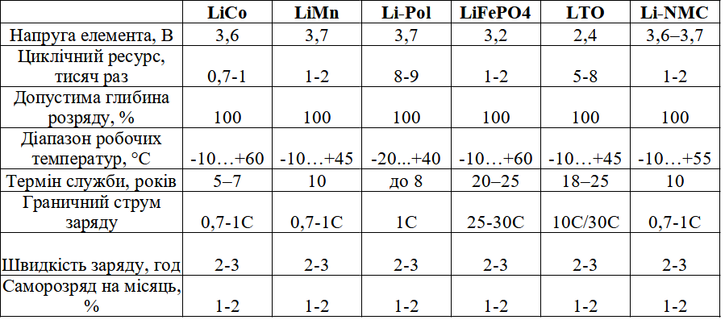

[Акумулятор літій-полімерний 10000 mAh, 3.7v, 1260110](https://alphapower.com.ua/ua/p1184584341-akkumulyator-litij-polimernyj.html)

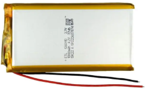

* Країна виробник: Китай
* Тип акумулятора: Li-Pol
* Напруга акумулятору; 3.7 V
* Ємність: 10000 мА/год
* Довжина: 110 мм
* Ширина: 60 мм
* Товщина 12 мм

Висновок

Після аналізу властивостей Li-ion акумуляторів, найбільш доцільним вибором є використання літій-полімерної (Li-Pol) батареї. Такий тип живлення добре зарекомендував себе у портативних пристроях завдяки ряду переваг: високій ємності та продуктивності, компактним розмірам і тонкому профілю, невеликій вазі, низькому саморозряду, відсутності вираженого ефекту пам’яті, підвищеній безпеці, екологічності та широкій доступності.

Враховуючи енергетичні потреби розробленого пристрою, оптимальним рішенням стане застосування шести Li-Pol акумуляторів ємністю 10000 мА·год, 3,7 В, з’єднаних у відповідності до електричної схеми (послідовно та паралельно для забезпечення необхідних режимів заряджання і розряджання).

Обраний акумулятор легко знайти у продажу, що спрощує його заміну у разі потреби. На відміну від інших типів (LiCo, LiMn, LiFePO4, LTO, Li-NMC) різних виробників і форм-факторів, Li-Pol акумулятори мають нижчу вартість, тонкий корпус і оснащені вбудованою платою захисту для контролю процесів заряджання та розряджання. Це робить їх найкращим вибором для живлення пристрою, забезпечуючи надійну роботу та простоту конструкції.

### Материнська плата

У цій частині розглядаються варіанти материнських плат, сумісних з модулем Raspberry Pi Compute Module 5, які виконують роль основи для підключення периферійних пристроїв, живлення та розширення функціональності системи. Порівняння різних моделей дозволяє визначити оптимальне рішення залежно від вимог до габаритів, кількості інтерфейсів, підтримки мультимедійних модулів, а також можливостей розширення та живлення.

1. Compute Module 5 IO Board

[CM4 IO Board](https://www.raspberrypi.com/products/compute-module-4-io-board/) 
це основна плата для підключення Raspberry Pi Compute Module 5 до різних периферійних пристроїв. Вона надає різноманітні порти та можливості підключення: HDMI, USB, Ethernet, слот для microSD, PCIe слот для розширення і підтримку камер через MIPI CSI-2.

Переваги:

* Розширення можливостей: надає доступ до всіх основних інтерфейсів для підключення периферії.
* Інтерфейси для дисплеїв і камер: підтримує MIPI DSI для дисплеїв та MIPI CSI-2 для камер, що дозволяє створювати мультимедійні системи.
* Підтримка PoE: можливість живлення через Ethernet (PoE) спрощує монтаж і зменшує потребу в додаткових живильних кабелях.

Недоліки:

* Потрібен додатковий обв'язок: вимагає підключення Compute Module 5, що збільшує складність розробки та інтеграції.
* Обмеження по кількості портів: деякі інтерфейси, такі як USB, обмежені в портах.

2. Waveshare CM4 IO Base Board B

Ця плата розроблена компанією [Waveshare](https://www.waveshare.com/cm4-io-base-b.htm) спеціально для Raspberry Pi Compute Module 5. Вона має компактний форм-фактор, зручний для вбудованих рішень, а також надає доступ до основних портів: HDMI, USB, Ethernet, камери та дисплеїв через MIPI.

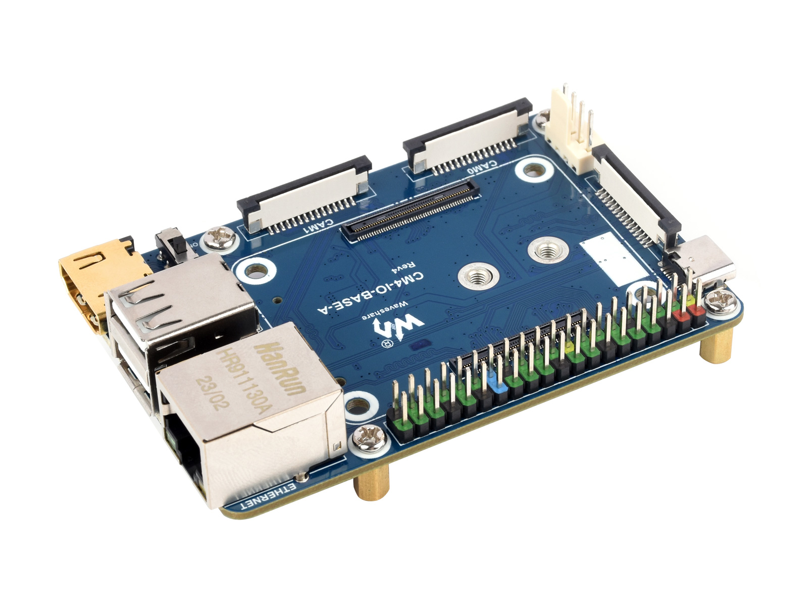

Переваги:

* Компактний розмір: зручно вбудовується у портативні пристрої, включаючи планшети.
* Повна підтримка CM4: має слот для eMMC-версій, слот microSD для Lite-версій.
* Виводи для GPIO: можна підключати сенсори, кнопки, інші периферійні пристрої.

Недоліки:

* Обмежені можливості розширення: відсутній PCIe слот.
* Відсутність PoE: не підтримується живлення через Ethernet.

3. Seeed Studio reComputer CM4 IO Board

Розроблена компанією [Seeed Studio](https://www.seeedstudio.com/reComputer-IO-Board-p-5279.html) для використання з CM4, плата reComputer IO Board орієнтована на промислові рішення та мультимедійні пристрої. Має повноцінний набір інтерфейсів, включаючи HDMI, USB 3.0, GbE Ethernet, слот PCIe, RTC, і підтримує до 2 камер.

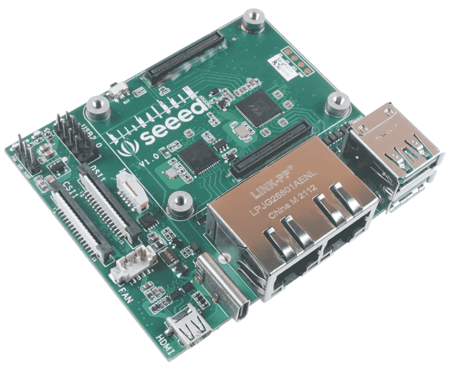

Переваги:

* Підтримка PCIe: дозволяє розширити функціональність через NVMe диски або інші модулі.
* Підтримка RTC: можливість точного відстеження часу без зовнішнього джерела.
* Гарна якість збірки та розведення.

Недоліки:

* Трохи більші габарити — не ідеально для тонких планшетів.
* Вища ціна у порівнянні з базовими платами.

<!-- #### [DFRobot Raspberry Pi CM4 IoT Router Carrier Board Mini](https://www.dfrobot.com/product-2590.html)

Хоча ця плата орієнтована на побудову маршрутизаторів на базі CM4, вона має компактний розмір і чудово підходить для мініатюрних планшетів з функціями зв’язку. Має два гігабітні порти, слот для microSD, USB 2.0, UART, і GPIO.

Переваги:

* Дуже компактна: ідеально підходить для планшетів та мобільних пристроїв.
* Добре підходить для мережевих рішень: два гігабітні Ethernet порти.
* GPIO на місці — для підключення сенсорів і модулів.

Недоліки:

* Обмежена мультимедійна підтримка: відсутній HDMI і роз'єм для дисплеїв.
* Немає PCIe і слотів для камер. -->

Висновок

Compute Module 5 IO Board — це еталонна плата від Raspberry Pi Foundation, яка надає найбільшу гнучкість для розробників. Вона підтримує всі ключові інтерфейси, включно з PCIe, двома камерами, двома дисплеями, PoE та великим числом GPIO. Завдяки офіційній підтримці, надійності та великій кількості доступної документації, ця плата є найкращою базою для побудови прототипів і повноцінних DIY-пристроїв.

Однак для досягнення оптимального результату у фінальному пристрої доцільно розробити власну материнську плату, яка буде враховувати специфічні вимоги проєкту: компактність, розташування розʼємів, мінімізацію зайвих компонентів та оптимізацію енергоспоживання. Власна плата дозволить інтегрувати лише необхідні інтерфейси, зменшити габарити та вагу пристрою, а також підвищити надійність і зручність експлуатації у польових умовах.

### Висновок по розділу  2.2

У цьому розділі було розглянуто основні компоненти, які можуть бути використані для побудови проекту. Raspberry Pi Compute Module 5 забезпечує високу продуктивність і гнучкість, а Compute Module 5 IO Board розширює можливості підключення периферійних пристроїв. Сенсорний дисплей IBM Lenovo Wacom дозволяє створювати інтерактивні інтерфейси, а HackRF-One відкриває можливості для роботи з радіочастотними сигналами. USB карта відеозахоплення LUX EasyCap є бюджетним рішенням для захоплення відео, а SSD диск Transcend MTS420S забезпечує швидке та надійне зберігання даних. Кожен із цих компонентів має свої переваги та недоліки, що слід враховувати при виборі елементної бази для конкретного застосування.
