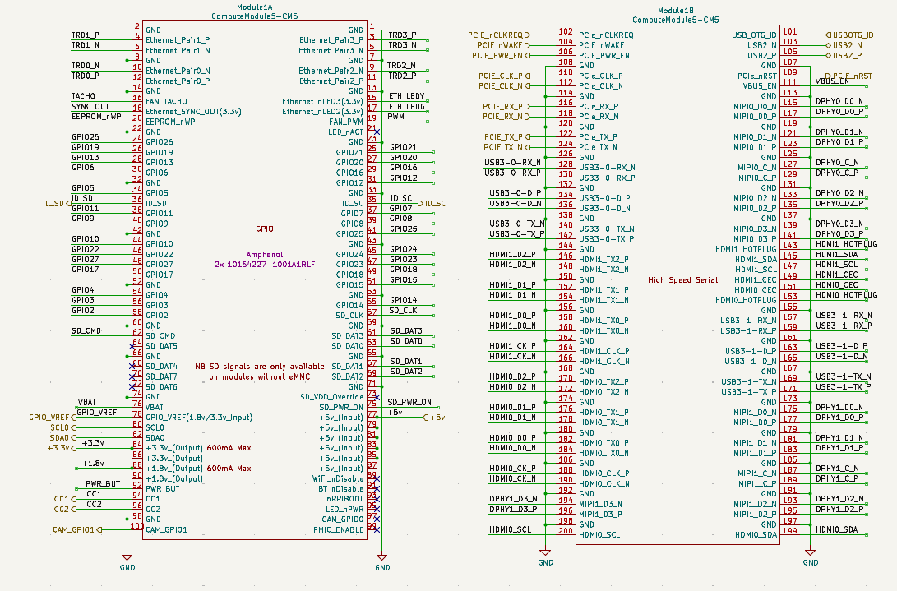
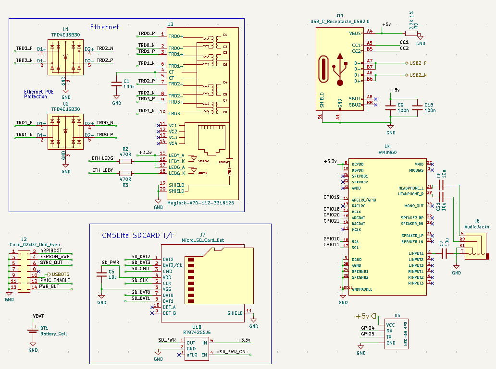
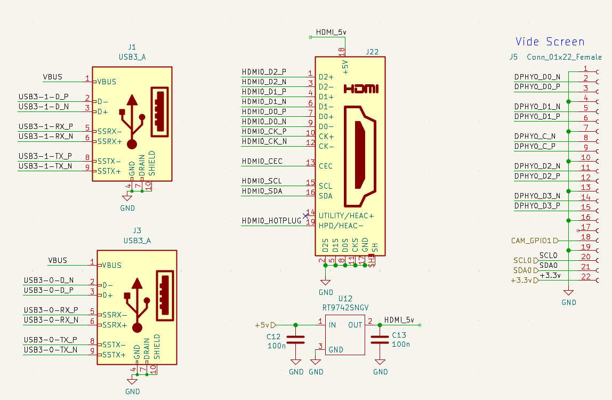
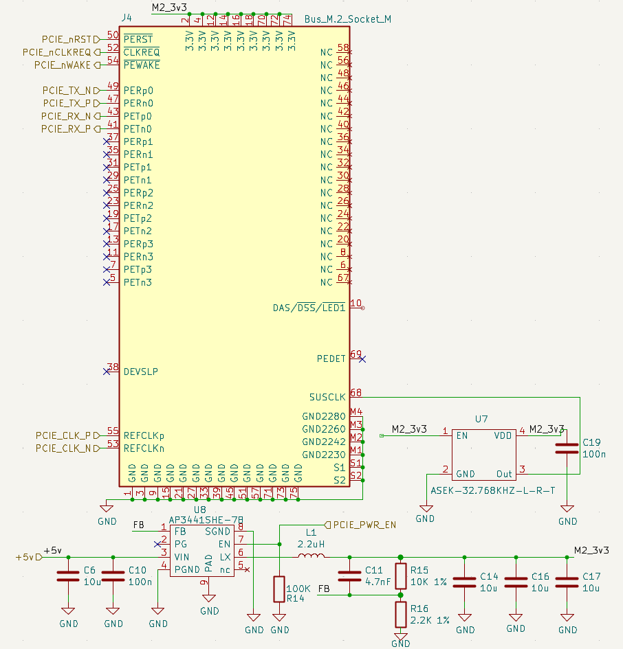
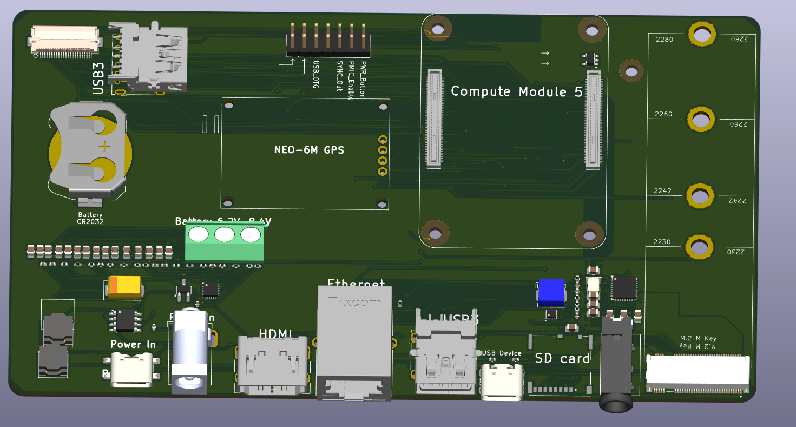

## Розробка принципової електричної схеми

В основі розроблюваної системи лежить процесорний модуль Raspberry Pi Compute Module 5. Цей модуль є центральним елементом, що забезпечує обробку даних та керування всіма функціями пристрою.

### Процесорний модуль та його інтерфейси:

На Рисунку 2.3.1 представлені деталі розводки ніжок (пінів) процесорного модуля. Це зображення є критично важливим для розуміння того, як модуль взаємодіє з іншими компонентами системи. Воно демонструє розташування та призначення всіх ключових виводів модуля, розділених на логічні групи для зручності проектування.

**Опис груп виводів, представлених на схемі:**

**Ліва сторона (Module1A):**

* **TRDI, TRD0, TRD1, TRD2_N/P:** Ці лінії є частиною інтерфейсу Ethernet. Вони забезпечують диференціальну передачу даних для мережевого підключення.
* **Ethernet_Pair_N/P:** Також відносяться до інтерфейсу Ethernet, формуючи чотири диференціальні пари, необхідні для реалізації 10/100/1000BASE-T зв'язку.
* **TACH0, SYNCHOUT, EEPROM_WPNP:** Ці виводи можуть бути пов'язані з керуванням синхронізацією або використанням спеціальних периферійних пристроїв. EEPROM_WPNP пов'язаний із захистом пам'яті.
* **GPIOx:** Велика кількість ніжок загального призначення (General Purpose Input/Output), які є універсальними для підключення широкого спектру периферійних пристроїв, таких як датчики, кнопки, світлодіоди, реле. Вони дозволяють конфігурувати лінії як вхідні або вихідні для керування зовнішніми пристроями або зчитування їх стану.
* **SD_CMD, SD_DATx:** Виводи для інтерфейсу SD-карти, що використовується для завантаження операційної системи та зберігання даних.
* **VBAT, GPIO_VREF, SCL0, SDA0:** VBAT - вхід для батареї або резервного живлення. SCL0 та SDA0 - лінії інтерфейсу I²C, що використовується для зв'язку з багатьма периферійними пристроями (датчики, EEPROM).
* **Позитивне живлення (+3.3V, +1.8V):** Вихідні або вхідні лінії живлення різних напруг, необхідні для роботи модуля та деяких зовнішніх компонентів.
* **PWR_BUT:** Лінія, яка може використовуватися для програмного вмикання/вимикання або перезавантаження модуля.
* **CCx_C/CAM_GPI01:** Лінії пов'язані з інтерфейсами камери (Camera Serial Interface - CSI), що дозволяє підключати цифрові камери.

**Права сторона (Module1B):**

* **USB_OTG_ID, USBx_N/P:** Ці виводи формують інтерфейс USB. USB_OTG_ID може використовуватися для визначення режиму роботи (Host/Device), а USBx_N/P - це диференціальні пари для передачі даних по USB.
* **VBUS_EN:** Лінія керування живленням для USB-пристроїв.
* **DPHY0_D/C_N/P, DPHY1_D/C_N/P, DPHY2_D/C_N/P, DPHY3_D/C_N/P:** Ці групи виводів відносяться до інтерфейсу MIPI D-PHY (Mobile Industry Processor Interface Physical Layer). Вони використовуються для високошвидкісної передачі даних до або від дисплеїв (DSI) та камер (CSI). Кожна група включає диференціальні лінії даних (D) та тактування (C).
* **HDMI_HOTPLUG, HDMI_HPD, HDMI_SCL, HDMI_CEC:** Виводи для інтерфейсу HDMI, що забезпечує виведення відеосигналу. HDMI_HOTPLUG та HDMI_HPD використовуються для визначення підключення дисплея. HDMI_SCL/SDA - лінії I²C для зв'язку з EDID-пам'яттю дисплея. HDMI_CEC - для керування зовнішніми пристроями через HDMI (Consumer Electronics Control).
* **USB3-X_RX/TX_P/N:** Ці лінії вказують на підтримку високошвидкісного інтерфейсу USB 3.0 (SuperSpeed USB), з окремими диференціальними парами для прийому (RX) та передачі (TX) даних.
* **HDMI0/1_D_N/P, HDMI0/1_CLK_N/P:** Основні диференціальні лінії даних та тактування для інтерфейсів HDMI.
* **HDMIO_SCL/SDA:** Додаткові лінії I²C для HDMI.

Використання цих виводів у принциповій електричній схемі буде детально описано у наступних підрозділах, де буде обґрунтовано вибір конкретних GPIO для керування периферичними пристроями, а також підключення високошвидкісних інтерфейсів до відповідних роз'ємів та компонентів.

### Організація кола живлення

Надійна система живлення є критично важливою для стабільної роботи будь-якого електронного пристрою. Представлена схема (Рисунок 2.3.2) демонструє архітектуру живлення, що забезпечує необхідні рівні напруги для всіх компонентів системи, включаючи процесорний модуль та периферійні пристрої. Система живлення розроблена для роботи від зовнішнього джерела постійного струму та включає кілька етапів перетворення та стабілізації напруги.

**Вхідний каскад живлення та захист:**

Живлення пристрою здійснюється через роз'єм **J10 (Barrel_Jack)**, призначений для підключення зовнішнього джерела постійного струму в діапазоні **6.2 В - 24 В**.
**Конденсатор C36 (100n 100V)**: Служить для фільтрації високочастотних шумів на вхідній лінії живлення, забезпечуючи більш чисту напругу для наступних перетворювачів.

**Мікросхема IP2326 (USB Type-C Power Delivery Controller/Converter):**

Мікросхема **IP2326 (U17)** [IP2326 datasheet !](http://lcsc.com/datasheet/lcsc_datasheet_2304062030_INJOINIC-IP2326_C2832094.pdf)
є ключовим елементом для живлення через інтерфейс USB Type-C, зокрема для реалізації функцій Power Delivery (PD). Це дозволяє не тільки живити пристрій від USB Type-C джерела, але й керувати режимами зарядки або живлення для інших пристроїв, підключених до USB.
**J6 (USB Type-C):** Це роз'єм USB Type-C, який підключається до IP2326.

**VBUS, CC1, CC2, D+, D-, SHIELD, GND:** Стандартні виводи роз'єму USB Type-C, які дозволяють передавати живлення (VBUS), дані (D+, D-) та керуючі сигнали (CC1, CC2), необхідні для ініціалізації Power Delivery.

**Обв'язка IP2326:**

* **PGND, LX, SW, VIN:** Вхідні та вихідні лінії для внутрішнього імпульсного перетворювача, який формує VBUS для USB.
* **VSYS_OUT, VSYS_IN, VBMON, VBAT_OUT, VBAT_IN, VBAT_GND:** Лінії, що стосуються системного живлення та моніторингу батареї. Це вказує на можливість керування зарядкою або живленням від акумулятора.
* **NTC, BAT_STAT, LED1:** Виводи для підключення термістора (NTC) для моніторингу температури батареї, індикації статусу зарядки (BAT_STAT) та світлодіода (LED1).
* **VSET, ISET, TIME_SET, EN, AC:** Керуючі виводи для налаштування вихідної напруги (VSET), струму (ISET), часу (TIME_SET), активації (EN) та індикації живлення від AC (AC).
* **R39, R34, R35, R37, R38:** Набір резисторів, які, використовуються для налаштування параметрів IP2326, таких як вихідна напруга, струм зарядки/живлення, або для визначення режимів PD.
* **L6, C54, C55, C56:** Індуктор та конденсатори, які є невід'ємною частиною імпульсного перетворювача для стабілізації та фільтрації напруги.

**Формування напруги +5В @ 5A (PSU):**

Цей блок відповідає за формування стабілізованої напруги **+5В** з високим струмом до **5А**, що є критично важливим для живлення процесорного модуля та інших високопотужних компонентів. Вхідна напруга для цього блоку становить **+6.2-24В**.
**U16 (AP64501SP-13):** Це імпульсний понижуючий перетворювач (Buck Converter) від Analog Power [AP64501SP-13 datasheet !](https://lcsc.com/datasheet/lcsc_datasheet_2108041630_Diodes-Incorporated-AP64501SP-13_C2071517.pdf)
. Його використання дозволяє ефективно перетворювати вхідну напругу (+12В) на потрібні +5В з мінімальними втратами на тепло.

* **VIN:** Вхід живлення від +12В. Фільтруючі конденсатори C34, C37, C38 (10u 35V) на вході забезпечують стабільність вхідної напруги та фільтрацію шумів.
* **BST, SW, PGND, GND, EN, FB:** Стандартні виводи імпульсного перетворювача: BST (bootstrap), SW (switching node), PGND (power ground), GND (signal ground), EN (enable), FB (feedback).
* **FB (Feedback):** Цей вивід підключається до резистивного дільника (R27, R28), який встановлює вихідну напругу +5В.
* **L5 (SRN6045TA-3R3Y):** Індуктор, який є ключовим компонентом імпульсного перетворювача. Його номінал (3.3 мкГн, судячи з маркування 3R3) важливий для стабільності та ефективності перетворення.
* **Конденсатори C47, C49, C50, C20:** Вихідні конденсатори (10u, 100u) для фільтрації та стабілізації вихідної напруги +5В, згладжуючи пульсації, характерні для імпульсних перетворювачів.
* **C58 (100n):** Додатковий фільтруючий конденсатор.
* **C59 (1.2nF), C60:** Ці компоненти є частиною компенсаційної мережі для стабільності зворотного зв'язку імпульсного перетворювача.
* **R25 (20K 1%), R27 (12K 1%), R28 (2.2K 1%):** Резистори зворотного зв'язку, що визначають точність вихідної напруги +5В. Їхня точність (1%) важлива для стабільності вихідної напруги.
* **D_Zener (D4):** Додатковий діод Зенера на виході +5В, що забезпечує захист від перенапруги для шини +5В.

**Кола фільтрації та розв'язки:**

По всій схемі розкидані конденсатори малої ємності (наприклад, 10n, 100n, 10u), які служать для блокування високочастотних шумів (decoupling capacitors) та згладжування пульсацій на лініях живлення поблизу мікросхем (C64, C65, C67, C68 поблизу U17). Це допомагає забезпечити стабільне та чисте живлення для чутливих цифрових та аналогових схем.

**Висновки щодо організації живлення:**

Представлена схема живлення є комплексною та добре продуманою, забезпечуючи:

1.  **Широкий діапазон вхідної напруги:** Можливість роботи від джерела 6.2В до 24В.
2.  **Гнучкість живлення:** Підтримка живлення через традиційний barrel jack та сучасний USB Type-C з Power Delivery.
3.  **Ефективність:** Використання імпульсних перетворювачів (AP64501SP-13) для формування +5В, що мінімізує втрати енергії та тепловиділення, особливо при великих струмах.
4.  **Стабілізація:** Забезпечення стабільних вихідних напруг (+5В, +12В) для всіх компонентів.
5.  **Захист:** Наявність діодів Зенера на вхідних та вихідних лініях живлення для захисту від перенапруги.
6.  **Фільтрація:** Широке використання фільтруючих та блокуючих конденсаторів для забезпечення чистого живлення.

Ця архітектура живлення забезпечує надійну та стабільну роботу всього електронного пристрою.

### Реалізація інтерфейсів та роз'ємів

Цей підрозділ детально описує ключові інтерфейси та роз'єми, які забезпечують взаємодію розроблюваного пристрою із зовнішнім світом, мережею та периферійними пристроями. Вибір та реалізація цих інтерфейсів є критично важливими для функціональності та гнучкості системи.

**Інтерфейс Ethernet:**

Блок Ethernet (верхня ліва частина схеми) забезпечує дротове мережеве підключення, що є важливим для стабільної та високошвидкісної передачі даних.

**U1 та U2 (TPD4E05B30):** Це мікросхеми захисту від електростатичного розряду (ESD) та перенапруги для ліній Ethernet [TPD4E05B30 datasheet !](https://www.alldatasheet.com/datasheet-pdf/view/796048/TI1/TPD4E02B04.html)
. Вони захищають диференціальні пари TRD0_N/P, TRD1_N/P, TRD2_N/P, TRD3_N/P, які несуть високошвидкісні сигнали даних, від пошкодження, що є критичним для надійної роботи мережевого інтерфейсу.

* **J3 (Magjack – A70-112-331N26):** Це інтегрований роз'єм Ethernet (RJ45) з вбудованим трансформатором та світлодіодними індикаторами стану (LED_A, LED_G).
* **Вбудований трансформатор:** Необхідний для гальванічної розв'язки між мережевим контролером та Ethernet-кабелем, захищаючи обладнання від перешкод та різних потенціалів землі.
* **LED_A (Activity/Link) та LED_G (Link/Activity):** Світлодіоди, підключені через резистори R2 (470R) та R3 (470R) до лінії +3.3В, індикують активність мережі та наявність з'єднання.
* **TRD_N/P (TDx+, TDx-):** Це виводи диференціальних пар для передачі/прийому даних Ethernet. Вони підключаються безпосередньо до процесорного модуля або до зовнішнього контролера Ethernet, якщо такий є. Конденсатори (C1, C2, C3, C4) на цих лініях служать для AC-зв'язку (фільтрації постійної складової) та узгодження імпедансу.

**Інтерфейс USB Type-C (J11):**

Роз'єм **J11 (USB_C_Receptacle_USB2.0)** забезпечує можливість живлення пристрою та обміну даними через стандартний інтерфейс USB Type-C.

* **VBUS:** Лінія живлення (+5В).
* **CC1, CC2:** Конфігураційні канали, які використовуються для визначення орієнтації кабелю, ролі пристрою (хост/пристрій) та узгодження режиму живлення (наприклад, USB Power Delivery, хоча цей роз'єм позначений як USB2.0). Резистори R4 та R5 (2.2K) на цих лініях використовуються для визначення ролі пристрою (наприклад, DFP/UFP).
* **D+, D-:** Диференціальні лінії даних USB 2.0. Конденсатори C18 та C19 (100n) служать для фільтрації високочастотних шумів на цих лініях.
* **SBU1, SBU2:** Додаткові лінії, які можуть використовуватися для альтернативних режимів роботи USB Type-C (наприклад, для передачі відео).
* **SHIELD, GND:** Заземлення та екран для захисту від перешкод.

**Інтерфейс CM5Lite SDCARD I/F (J7):**

Цей блок відповідає за підключення карти пам'яті формату MicroSD, яка, як правило, використовується для зберігання операційної системи, програмного забезпечення та даних.

* **J7 (Micro_SD_Card_Det):** Роз'єм для MicroSD-карти з детектором присутності карти.
* **SD_DAT0, SD_DAT1, SD_DAT2, SD_DAT3, SD_CMD, SD_CLK:** Стандартні виводи для інтерфейсу SD-карти (data, command, clock).
* **U1B (RTS7420GJS):** Це мікросхема що забезпечує перетворення рівня напруги (level shifter) або керування живленням для SD-карти.
* **SD_PWR:** Лінія керування живленням SD-карти.
* **IN, OUT, INFO, EN:** Вхідні та вихідні лінії для керування живленням, інформації про стан та активації. Конденсатор C51 (4.7u) на виході PWR_ON є фільтруючим.

**Аудіоінтерфейс (U4 та J8):**

Блок аудіо забезпечує відтворення та запис звуку.

* **U4 (WM8960):** Це аудіокодек, який інтегрує аналого-цифрові та цифро-аналогові перетворювачі (АЦП/ЦАП), а також підсилювачі для навушників/динаміків та мікрофонні входи [WM8960 datasheet !](http://lcsc.com/datasheet/lcsc_datasheet_2410121530_Cirrus-Logic-WM8960CGEFL-RV_C18752.pdf).
* **DCVDD, DBVDD, AVDD, SPKVDD2:** Лінії живлення для різних секцій кодека (цифрова, аналогова, живлення динаміка). Фільтруючі конденсатори C3, C11, C12, C13, C14, C21 забезпечують стабільне живлення.
* **MCLK, BCLK, DACLRC, ADCLRC, DACDAT, ADCDAT:** Лінії для обміну даними та тактовими сигналами з процесорним модулем (Master Clock, Bit Clock, Left/Right Clock, Data In/Out).
* **HEADPHONE_L/R, SPEAKER_L/R, SPEAKER_EN:** Виходи для навушників та динаміків, а також лінія керування вмиканням/вимиканням динаміків.
* **MONO_OUT:** Монофонічний аудіовихід.
* **LINPUTx, RINPUTx:** Вхідні лінії для підключення мікрофонів або інших аудіоджерел (наприклад, LINPUT1-3, RINPUT1-3).
* **GPIOx:** Додаткові виводи загального призначення, які можуть використовуватися для керування або індикації.
* **AGND, DGND:** Аналогове та цифрове заземлення.
* **J8 (Audiojack4):** Роз'єм для підключення аудіопристроїв, таких як навушники або зовнішні динаміки.

**Додаткові інтерфейси та керування живленням (J2):**

Цей блок, позначений як **Conn 02/07 Odd Even**, містить різні керуючі та інтерфейсні лінії, що підключаються до процесорного модуля.

* **NRPBOOT, EEPROM_WPNP:** Лінії, пов'язані з режимом завантаження (NRPBOOT) та захистом пам'яті EEPROM (EEPROM_WPNP).
* **SYNC_DTG:** Лінія синхронізації.
* **USBDT_G:** Пов'язана з USB (USB debug).
* **PMIC_ENABLE, PWR_BUT:** Лінії керування живленням, які дозволяють вмикати/вимикати або перезавантажувати систему.
* **VBAT:** Лінія для підключення зовнішнього джерела живлення батареї, або для моніторингу системної напруги.

**Інтерфейс GPS (U5):**
У нижній правій частині схеми представлений блок для інтеграції GPS-модуля.
* **GPIO4, GPIO5:** Це лінії GPIO, які використовуються для обміну даними (RX, TX) з GPS-модулем через інтерфейс UART, що є стандартним для багатьох GPS-приймачів.

**Висновки щодо реалізації інтерфейсів:**

Надана схема демонструє комплексну реалізацію різноманітних інтерфейсів, які є фундаментальними для функціональності пристрою. Це включає:

* **Надійне мережеве підключення** через Ethernet з вбудованим захистом та трансформатором.
* **Гнучке живлення та передачу даних** через USB Type-C.
* **Можливість розширення пам'яті** за допомогою MicroSD-карти.
* **Повноцінний аудіоінтерфейс** з кодеком для відтворення та запису звуку.
* **Інтеграція GPS-модуля** для визначення місцезнаходження.
* **Керування живленням** та іншими системними функціями через спеціалізовані виводи.

Кожен з цих інтерфейсів ретельно розроблений з урахуванням необхідних захисних елементів та фільтрації для забезпечення стабільної та надійної роботи.

### Реалізація високошвидкісних інтерфейсів та роз'ємів

У цьому підрозділі продовжено опис ключових інтерфейсів, зосереджуючись на високошвидкісних лініях передачі даних, які є критично важливими для мультимедійних та периферійних функцій пристрою.

**Інтерфейси USB 3.0:**

На схемі представлені два роз'єми **USB3_A (J1 та J3)**, що вказує на наявність як мінімум двох портів USB 3.0. Це забезпечує високу швидкість передачі даних для підключення сучасних периферійних пристроїв, таких як зовнішні накопичувачі, вебкамери високої роздільної здатності тощо.

* **VBUS:** Лінія живлення (+5В) для підключених USB-пристроїв.
* **D+, D-:** Стандартні диференціальні пари даних для USB 2.0 (High-Speed). Вони сумісні з USB 3.0 та дозволяють працювати з пристроями USB 2.0.
* **SSRX+, SSRX-:** Диференціальні пари для прийому даних (SuperSpeed Receive) USB 3.0. Забезпечують швидкість до 5 Гбіт/с.
* **SSTX+, SSTX-:** Диференціальні пари для передачі даних (SuperSpeed Transmit) USB 3.0. Також забезпечують швидкість до 5 Гбіт/с.
* **GND, SHIELD:** Заземлення та екран роз'єму для захисту від електромагнітних перешкод.

Наявність двох окремих роз'ємів USB 3.0 означає, що система підтримує кілька одночасних високошвидкісних підключень, що підвищує її функціональність. Ці лінії USB3-x-y-D_N/P та USB3-x-y-RX/TX_N/P підключаються безпосередньо до відповідних виводів процесорного модуля, як це було показано на Рисунку 2.3.1 (Модуль Module1B).

**Інтерфейс HDMI:**

Роз'єм **HDMI (J22)** є ключовим для виведення високоякісного відео та аудіосигналу на зовнішні дисплеї (монітори, телевізори).

* **HDMI0_D0_P/N, HDMI0_D1_P/N, HDMI0_D2_P/N:** Це три диференціальні пари даних (TMDS data channels), які передають власне відеодані.
* **HDMI0_CLK_P/N:** Диференціальна пара тактування (TMDS clock), яка синхронізує передачу даних.
* **HDMI0_CEC (Consumer Electronics Control):** Лінія, що дозволяє керувати іншими HDMI-сумісними пристроями (наприклад, вмикати телевізор, перемикати вхід).
* **HDMI0_SCL, HDMI0_SDA:** Лінії інтерфейсу I²C, які використовуються для обміну даними EDID (Extended Display Identification Data) з підключеним дисплеєм. Це дозволяє пристрою дізнаватися про підтримувані роздільні здатності та формати дисплея.
* **HDMI0_HOTPLUG (HPD/HEAC):** Лінія Hot Plug Detect, яка інформує пристрій про підключення або відключення HDMI-кабелю. Також може використовуватися для функцій HDMI Ethernet Channel (HEAC).
* **+5V_D:** Лінія живлення +5В для живлення EDID EEPROM у кабелі HDMI та для керування деякими функціями.
* **U12 (RT9742SNGV):** Це мікросхема керування живленням або захисний елемент для лінії +5V_D, що забезпечує стабільне живлення та/або захист від перевантажень/коротких замикань на HDMI-роз'ємі. Конденсатори C12 та C13 (100n) служать для фільтрації шуму на лінії живлення.

Лінії HDMI (HDMI0_D_N/P, HDMI0_CLK_N/P, HDMI0_CEC, HDMI0_SCL/SDA, HDMI0_HOTPLUG) безпосередньо підключаються до відповідних виводів процесорного модуля, які позначені на Рисунку 2.3.1 (Модуль Module1B) в секції "High Speed Serial".

**Інтерфейс для екрану (MIPI D-PHY / Video Screen - J5):**

Роз'єм **J5 (Conn_01x1x22_Female)** призначений для підключення зовнішнього дисплея з використанням інтерфейсу MIPI D-PHY (Mobile Industry Processor Interface Physical Layer). Це високошвидкісний інтерфейс, який зазвичай використовується для підключення дисплеїв (DSI - Display Serial Interface) та камер (CSI - Camera Serial Interface) у мобільних та вбудованих системах.

* **DPHYO_D0_N/P, DPHYO_D1_N/P, DPHYO_D2_N/P, DPHYO_D3_N/P:** Це чотири диференціальні пари даних MIPI D-PHY. Кожна пара передає дані послідовно.
* **DPHYO_C_N/P:** Диференціальна пара тактування MIPI D-PHY, що синхронізує передачу даних по всіх парах даних.
* **CAM_GPIO1D1:** Цей вивід є лінією GPIO, пов'язаною з функціями камери або дисплея, яка може використовуватися для керування (наприклад, скидання дисплея, вмикання підсвічування) або індикації стану.
* **SCL0, SDA0:** Лінії інтерфейсу I²C, що використовуються для зв'язку з дисплеєм (наприклад, для керування підсвічуванням, отримання інформації про дисплей). Ці ж лінії I²C можуть бути мультиплексовані з іншими інтерфейсами (наприклад, HDMI I²C, як показано на Рисунку 2.3.1).
* **+3.3V, GND:** Лінії живлення (+3.3В) та заземлення для живлення дисплея.

Використання MIPI D-PHY для підключення екрану підкреслює орієнтацію проекту на компактні рішення та високу якість зображення, характерну для мобільних пристроїв. Лінії DPHYO_D_N/P та DPHYO_C_N/P безпосередньо підключаються до відповідних виводів процесорного модуля, як це було показано на Рисунку 2.3.1 (Модуль Module1B) у секції "High Speed Serial".

**Висновки щодо реалізації високошвидкісних інтерфейсів:**

Наданий фрагмент схеми демонструє високий рівень функціональності пристрою в частині мультимедіа та підключення периферії. Наявність двох портів USB 3.0 забезпечує швидкий обмін даними, тоді як HDMI та MIPI D-PHY дозволяють підключати різноманітні дисплеї, від зовнішніх моніторів до вбудованих екранів, забезпечуючи високоякісний відеовихід. Усі ці інтерфейси спроектовані з урахуванням вимог до цілісності сигналу та захисту, що є критичним для їхньої стабільної та надійної роботи.

### Реалізація інтерфейсу M2

У цьому підрозділі розглянуто реалізацію інтерфейсу M.2, який забезпечує гнучкість у підключенні додаткових модулів, таких як NVMe SSD, Wi-Fi/Bluetooth модулі, або 4G/5G модеми, а також пов'язані з ним компоненти живлення та тактування.

**Інтерфейс M.2 (Bus_M.2_Socket_M):**

Роз'єм **J4 (Bus_M.2_Socket_M)** є основним інтерфейсом для підключення M.2 модуля. Він забезпечує високошвидкісний зв'язок через шину PCIe, а також інші необхідні сигнали.

* **PCIe_TX_N/P, PCIe_RX_N/P (PERPx, PERPx_N/P):** Ці диференціальні пари представляють лінії передачі (TX) та прийому (RX) для інтерфейсу PCI Express (PCIe). На схемі показано чотири канали PCIe (PERP0, PERP1, PERP2, PERP3), що вказує на підтримку PCIe x4. Це дозволяє підключати високопродуктивні NVMe SSD, які потребують високої пропускної здатності.
* **PCIe_NRSTD, PCIe_NCLKREQ, PCIE_NWAKE:** Це керуючі сигнали PCIe.
* **PCIe_NRSTD:** Скидання PCIe (Reset).
* **PCIe_NCLKREQ:** Запит тактування PCIe (Clock Request), використовується для керування режимами енергозбереження.
* **PCIE_NWAKE:** Сигнал пробудження PCIe (Wake-up).
* **NC (No Connect):** Багато виводів роз'єму позначені як NC, що означає "не підключено". Це стандартно для універсальних роз'ємів M.2, де не всі піни використовуються у всіх конфігураціях.
* **3.3V:** Лінії живлення +3.3В для M.2 модуля.
* **PEDET (Pin Event Detect):** Цей вивід може використовуватися для виявлення присутності модуля або інших подій, пов'язаних з ним.
* **DAS/DSS/LED1:** Ці виводи можуть використовуватися для індикації активності даних (Data Activity Status), стану диска (Drive Status), або для керування світлодіодом (LED1) на M.2 модулі.

Лінії PCIe_TX_N/P, PCIe_RX_N/P, PCIe_NCLKREQ, PCIE_NWAKE та PCIe_NRSTD підключаються безпосередньо до відповідних виводів процесорного модуля, як це було показано на Рисунку 2.3.1 (Module1B) у секції "PCIe".

**Живлення для M.2 модуля (+3.3В):**

Для забезпечення стабільного живлення M.2 модуля використовується окремий імпульсний понижуючий перетворювач, що формує напругу +3.3В.

* **U8 (AP3441SHE-7B):** Це синхронний понижуючий DC/DC перетворювач. Він приймає вхідну напругу +5В та перетворює її на +3.3В, необхідні для живлення M.2 модуля [AP3441SHE datasheet !](https://lcsc.com/datasheet/lcsc_datasheet_2304140030_Diodes-Incorporated-AP3441SHE-7B_C2070918.pdf).
* **VIN:** Вхід живлення від +5В. Конденсатори C6 (10u) та C10 (100n) забезпечують фільтрацію вхідної напруги.
* **FB (Feedback):** Вивід зворотного зв'язку, підключений до резистивного дільника (R14 - 100K), який визначає вихідну напругу +3.3В.
* **EN:** Вивід керування дозволом (Enable) для увімкнення/вимкнення перетворювача. Підключення до "PCIE_PWR_EN" вказує, що живлення для M.2 активується за певним керуючим сигналом.
* **LX, SW, PGND, GND, SGND:** Виводи для внутрішнього імпульсного перетворювача (комутаційний вузол, силові та сигнальні заземлення).
* **L1 (2.2uH):** Індуктор, який є ключовим компонентом імпульсного перетворювача, необхідний для накопичення енергії та формування стабілізованої вихідної напруги.
* **C11 (4.7nF):** Компенсаційний конденсатор.
* **R15 (10K 1%), R16 (2.2K 1%):** Резистори зворотного зв'язку, що разом з R14 формують дільник напруги для встановлення точної вихідної напруги +3.3В.
* **C14, C16, C17 (10u, 10u, 10u):** Вихідні конденсатори для фільтрації та стабілізації вихідної напруги +3.3В, згладжуючи пульсації.

**Тактування PCIe (PCIe_CLK):**

Для коректної роботи інтерфейсу PCIe необхідний стабільний тактовий сигнал.

* **U7 (ASEK-32.768KHZ-L-R-T):** Це генератор тактового сигналу (кварцовий генератор або осцилятор), який забезпечує тактування для PCIe. Хоча маркування 32.768KHz зазвичай вказує на годинниковий кварц, це може бути помилка або ж це базовий генератор, від якого походить основне тактування через PLL. Важливо, що він забезпечує референсний тактовий сигнал для PCIe.
* **EN:** Вхід дозволу для увімкнення генератора.
* **VDD:** Живлення (+3.3В).
* **Out:** Вихід тактового сигналу.
* **PCIe_CLK_N/P:** Ці виводи представляють диференціальну пару для тактового сигналу PCIe (PCIe Reference Clock), яка подається на M.2 роз'єм. Диференціальне тактування є критичним для високошвидкісних інтерфейсів, оскільки зменшує вплив шуму та забезпечує точну синхронізацію.

**Висновки щодо реалізації інтерфейсу M.2:**

Інтеграція інтерфейсу M.2 значно розширює функціональні можливості пристрою, дозволяючи підключати різноманітні високопродуктивні модулі. Розробка забезпечує:

* **Високошвидкісний зв'язок:** Підтримка PCIe x4 для максимальної пропускної здатності.
* **Стабільне живлення:** Окремий ефективний DC/DC перетворювач для +3.3В живлення M.2 модуля.
* **Надійне тактування:** Забезпечення стабільного диференціального тактового сигналу для PCIe.
* **Керування живленням та станом:** Наявність керуючих ліній для активації та моніторингу модуля.

Ця реалізація підкреслює модульність та розширюваність архітектури пристрою, дозволяючи адаптувати його під різні завдання за допомогою стандартних компонентів M.2.

### Загальна компоновка та 3D вигляд друкованої плати

Після розробки принципової електричної схеми наступним етапом є компоновка компонентів на друкованій платі (PCB) та її фізичне проектування. Цей підрозділ надає 3D вигляд розробленої плати, демонструючи розташування ключових функціональних блоків та роз'ємів, що забезпечує інтуїтивне розуміння фізичної реалізації пристрою.

На Рисунку 2.3.4 представлено 3D вигляд розробленої друкованої плати, що включає всі компоненти та інтерфейси, детально описані в попередніх підрозділах. Компоновка плати оптимізована для забезпечення ефективного розподілу живлення, мінімізації шумів, цілісності високошвидкісних сигналів та зручності монтажу.

**Ключові елементи та їх розташування на платі:**

1.  **Процесорний модуль (Compute Module 5):**
    Розташований у верхній правій частині плати. Це центральний елемент, що підключається до системного роз'єму (SO-DIMM-подібний роз'єм). Його близьке розташування до високошвидкісних інтерфейсів (таких як HDMI, MIPI D-PHY, PCIe) мінімізує довжину доріжок, що критично для цілісності сигналу.

2.  **Роз'єми USB 3.0 (USB3):**
    Два роз'єми USB 3.0 розташовані у верхній лівій частині плати. Це дозволяє зручно підключати зовнішні високошвидкісні периферійні пристрої, такі як накопичувачі або камери.

3.  **GPS-модуль (NEO-6M GPS):**
    Розташований у центральній лівій частині плати. Ймовірно, це модуль UBLOX NEO-6M, що забезпечує функціональність визначення місцезнаходження. Його розташування на краю плати або в зоні з мінімальними перешкодами допомагає покращити прийом супутникового сигналу. Поруч, імовірно, знаходиться роз'єм для зовнішньої GPS-антени (маленький золотий роз'єм).

4.  **Кола живлення (Power In, Battery CR2032, Battery 6.2V-24V):**
    * **"Power In" (Barrel Jack):** Розташований у нижній лівій частині плати. Це основний вхід для живлення пристрою від зовнішнього адаптера.
    * **"Battery CR2032":** Тримач для батареї CR2032, ймовірно, для живлення годинника реального часу (RTC) процесорного модуля. Розташований біля роз'ємів USB3.
    * **"Battery 6.2V-24V":** Гвинтові клеми або аналогічний роз'єм для підключення зовнішнього джерела живлення в діапазоні 6.2В-24В, що забезпечує гнучкість у виборі джерела живлення. Розташований у верхній центральній частині плати.
    * Навколо цих роз'ємів розташовані компоненти, що відповідають за стабілізацію та фільтрацію живлення, як описано в підрозділі 2.2.

5.  **Інтерфейси Ethernet, HDMI, USB Device, SD Card:**
    Ці ключові роз'єми компактно розташовані вздовж нижнього краю плати.
        * **Ethernet:** Роз'єм RJ45 для дротового мережевого підключення.
        * **HDMI:** Роз'єм для підключення зовнішнього дисплея.
        * **USB Device (Type-C):** Роз'єм USB Type-C, який може використовуватися як для живлення, так і для підключення пристрою в режимі USB-пристрою (наприклад, для завантаження ОС або дебагування).
        * **SD Card:** Слот для MicroSD-карти, що служить для зберігання операційної системи та даних.

6.  **M.2 M Key:**
    Роз'єм M.2 M Key розташований у нижній правій частині плати. Це дозволяє підключати високошвидкісні NVMe SSD або інші сумісні M.2 модулі (наприклад, 4G/5G модеми), значно розширюючи можливості пристрою.

7.  **Інші компоненти:**
    Інші пасивні компоненти (резистори, конденсатори, індуктивності) та активні мікросхеми (стабілізатори, логічні елементи, аудіокодек) розташовані по всій платі відповідно до їхніх функціональних блоків та вимог до трасування сигналів. Вони, як правило, розміщуються якомога ближче до компонентів, з якими вони взаємодіють, для мінімізації довжини доріжок та зменшення перешкод.

Висновок до розділу 2.3

Компоновка друкованої плати виконана з урахуванням оптимального розміщення компонентів для досягнення високої функціональності та надійності. Центральне розташування процесорного модуля та грамотне розміщення високошвидкісних інтерфейсів, таких як PCIe, HDMI та USB 3.0, є ключовим для забезпечення цілісності сигналу. Інтегровані рішення для живлення та захисту, а також підтримка широкого спектру периферійних інтерфейсів, роблять цю плату гнучким та потужним рішенням для різних вбудованих застосувань. Цей 3D вигляд наочно демонструє результати етапу розробки принципової електричної схеми та є основою для подальшого виробництва.
