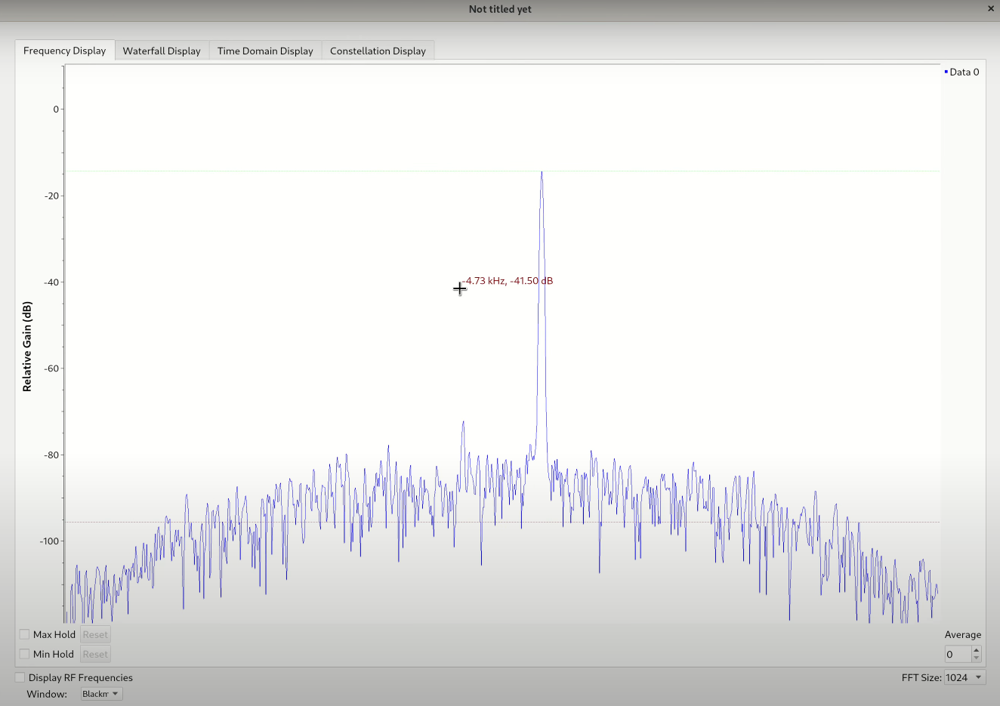
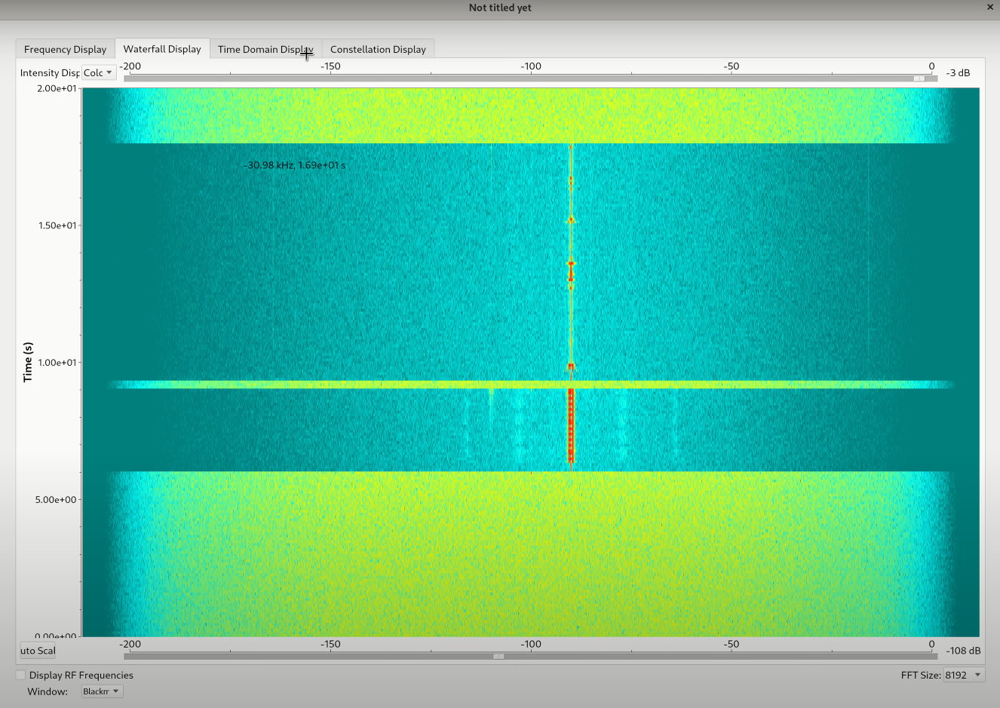
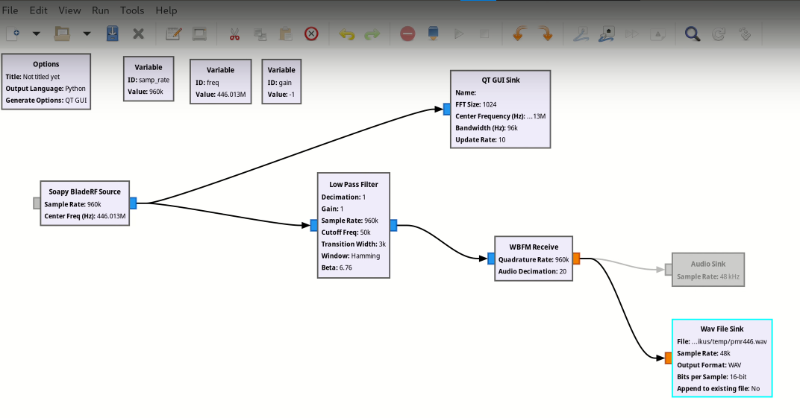

# **ЕКСПЕРИМЕНТАЛЬНЕ ВИПРОБУВАННЯ**

У цьому розділі представлено практичні випробування, проведені з метою перевірки працездатності та ефективності використання програмно-визначеного радіо (SDR) для прийому та обробки радіосигналів у реальних умовах. Основна увага зосереджена на експериментах, які демонструють можливості сучасних SDR-приймачів і програмних засобів для роботи з аналоговими та супутниковими сигналами.

Використання гнучких програмно-апаратних платформ дає змогу реалізовувати прийом, фільтрацію, демодуляцію та збереження сигналів без потреби у складному радіоелектронному обладнанні. Такий підхід відкриває нові перспективи для навчання, досліджень і прикладних завдань, пов’язаних з аналізом радіочастотного спектра.

У рамках випробувань було реалізовано два експерименти: прийом аналогового сигналу за допомогою портативної рації та SDR-приймача, а також дистанційний прийом супутникового зображення за допомогою онлайн-сервісу WebSDR. Обидва сценарії показують, як за допомогою доступних інструментів можна реалізувати повноцінну систему радіоприйому, обробки та візуалізації сигналу.

<!-- подяка автору https://www.youtube.com/watch?v=IaThnn2r1no -->

## Прийом аналогового радіосигналу портативною рацією

Використане обладнання:

* Джерело сигналу — рація Baofeng.
* Приймач — BladeRF (АПКВАР).
* Програмне забезпечення для обробки — GNU Radio.

**Основні характеристики та можливості Baofeng**

* Працює у **VHF** (136-174 МГц) та **UHF** (400-520 МГц) діапазонах.
* **Вихідна потужність:** 1 до 8 Вт. Потужність впливає на дальність зв’язку. Варто враховувати, що заявлена потужність не завжди відповідає реальній, але навіть 5 Вт достатньо для більшості побутових і аматорських задач.
* **Модуляція:** **FM (частотна модуляція)** — типовий стандарт для портативних рацій, забезпечує якісний звук.
* **Кількість каналів:** Від 128 до 200 програмованих каналів, що дозволяє зберігати багато частот.
* **Функціональні можливості:**
    * **Два канали одночасно (Dual Watch/Dual Receive):** Можливість стежити за двома частотами одночасно.
    * **VOX (Voice Operated eXchange):** Автоматичний початок передачі голосом без натискання кнопки PTT.
    * **CTCSS/DCS (Tone Squelch):** Тоновий шумоподавлювач для фільтрації небажаних сигналів і прослуховування лише своєї групи.

Виконання експерименту [Прийом аналогового радіосигналу !](https://www.youtube.com/watch?v=IaThnn2r1no).

**1. Конфігурація GNU Radio для прийому сигналу:**

* Задаються параметри, частота 446.13 МГц та частота дискретизації (Sample Rate).
* Посилення (Gain) встановлюється на мінімум (-1).
* Використовується блок Osmocom Source з параметрами, налаштованими під конкретний SDR-приймач (BladeRF).
* Для візуалізації спектра застосовується блок GUI Sink.

**2. Виведення сигналу на аудіосистему комп’ютера:**

* Для прослуховування сигналу через комп’ютер додаються блоки аудіообробки.
* Встановлюється фільтр низьких частот (Low Pass Filter) для виділення потрібного каналу.
    * Налаштовуються параметри: Sample Rate, Cutoff Frequency (наприклад, 50 кГц) і Transition Width (наприклад, 3 кГц).
* Додається блок FM Demod для демодуляції FM-сигналу.
    * Вказуються Sample Rate і Audio Decimation.
* Для виведення звуку використовується блок Audio Sink.
    * Sample Rate аудіовиходу — наприклад, 48 кГц.

**3. Запис сигналу у файл:**

* Для запису ефіру блок Audio Sink вимикається.
* Замість нього активується блок Wave File Sink.
* Вказується шлях до файлу, кількість каналів (1 — моно) і Sample Rate (48000 Гц).

Висновок

У ході експерименту було успішно прийнято та оброблено аналоговий радіосигнал за допомогою SDR-приймача BladeRF та програмного забезпечення GNU Radio. Проведено налаштування параметрів прийому, демодуляції та виводу аудіосигналу, а також здійснено запис ефіру у файл. Отримані результати підтверджують можливість використання SDR для аналізу та обробки аналогових радіосигналів, а також демонструють гнучкість та функціональність сучасних цифрових систем радіоприйому.

<!-- дякую https://www.youtube.com/watch?v=cjClTnZ4Xh4 -->

##  Прийом супутникових зображень

Обладнання

* **[WebSDR](http://websdr.org/):**  який має можливість прийому на частотах метеорологічних супутників. Обираємо WebSDR з **антеною Double Cross** з круговою поляризацією для кращого прийому.
* **Програмне забезпечення:**
    * **SDR#** (SDRSharp) – ці програми не підключатимуться до WebSDR напряму, але ми використовуватимемо їх для **демодуляції аудіосигналу** з WebSDR.
    * **[LRPTDecoder](https://www.rtl-sdr.com/m2_lrpt_decoder-version-59-released/)** – для декодування сигналу.
    * **Orbitron** або **Gpredict** – програми для відстеження супутників і прогнозування їх проходження над нашим місцезнаходженням.
    * **Віртуальний аудіокабель** [VB-Cable](https://vb-audio.com/Cable/) – програма для перенаправлення аудіо з браузера (де працює WebSDR) до програм декодування (LRPTDecoder).
* **Супутник:**
    * **[NOAA 15, 18, 19](https://uk.wikipedia.org/wiki/NOAA-19):**

Виконання експеременту [Прийом супутникових зображень !](https://www.youtube.com/watch?v=cjClTnZ4Xh4)

**1. Підключення до WebSDR та захоплення сигналу**

1.  **Вибір WebSDR:** Ми знайдемо відповідний WebSDR. Шукатимемо в пошуку за запитом "WebSDR 137 MHz" або "WebSDR NOAA Meteor". Переконаємося, що він активний та має хорошу антену.
2.  **Відстеження супутника:** Запустимо **[Orbitron](https://www.stoff.pl/)**. Введемо наші координати та додамо TLE-дані для NOAA 15/18/19 . Програма покаже нам час проходження супутників над зоною покриття WebSDR.
3.  **Налаштування WebSDR:** За кілька хвилин до проходження супутника налаштуємо частоту WebSDR на відповідну частоту супутника 137.9125 МГц . Використовуватимемо **режим NFM** (narrowband FM) для NOAA та **широкосмуговий FM** (WFM) або **пряме захоплення IQ-сигналу** (якщо WebSDR це підтримує) для Meteor M2.
4.  **Запис аудіосигналу:** Під час проходження супутника записуватимемо аудіосигнал з WebSDR. Якщо WebSDR має функцію запису, використаємо її. В іншому випадку, нам потрібно буде перенаправити аудіо з браузера через **Віртуальний аудіокабель** в програму запису аудіо Audacity.

**2. Декодування зображення**

* Відкриємо LRPTDecoder.
* Якщо ми записували аудіофайл, конвертуємо його в потрібний формат за допомогою SDR#.
* Завантажимо файл до LRPTDecoder.
* Запустимо процес демодуляції та декодування. LRPTDecoder створить зображення.

Висновок:

У ході експерименту було успішно прийнято та декодовано супутникове зображення за допомогою WebSDR та спеціалізованого програмного забезпечення. Використання WebSDR дозволило отримати сигнал без необхідності власного радіообладнання, а програмні інструменти забезпечили обробку та декодування даних у зображення. Результати підтверджують ефективність дистанційного прийому супутникових сигналів і демонструють доступність сучасних SDR-технологій для аматорських досліджень у сфері радіозв'язку та супутникової метеорології.

## Висновок по розділу 4

У цьому розділі було розглянуто практичні аспекти роботи з SDR (Software Defined Radio) для прийому та обробки аналогових і супутникових радіосигналів. Проведені експерименти показали, що SDR-платформи забезпечують гнучкість, універсальність і доступність для дослідників та аматорів. Використання сучасного програмного забезпечення дозволяє не лише приймати сигнали, а й виконувати їхню демодуляцію, декодування та подальшу обробку. Таким чином, SDR-технології відкривають широкі можливості для експериментів у сфері радіозв'язку, навчання та досліджень, а також сприяють популяризації радіоелектроніки серед широкого кола користувачів.