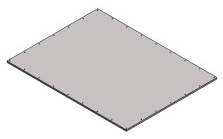
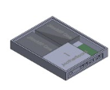

# Тиждень 4. Розробка 3D-моделі корпусу пристрою в SolidWorks

На четвертому тижні практики було виконано повний цикл 3D-моделювання корпусу портативного автоматизованого комплексу в середовищі SolidWorks. Згідно з попередньо обґрунтованими вимогами, для конструкції було обрано алюміній як основний матеріал корпусу, а органічне скло (PMMA) — для екранної панелі.

## 1. Основний корпус (Box)

Корпус пристрою змодельовано у вигляді прямокутної рами з ребрами жорсткості та технологічними отворами. До ключових особливостей моделі належать:

* Отвори під антени та роз’єми, що мають посадочні діаметри під стандартні модулі. Вони розташовані з урахуванням зручності підключення зовнішніх пристроїв.
* Внутрішні виступи для фіксації електронних компонентів, батарейного блоку та кріплень.
* Площини під монтажні отвори для кришки екрана та захисної накладки роз’ємів.
* Контури ущільнювального каналу для гумового кільця або прокладки, що забезпечить рівень захисту IP65.

## 2. Кришка роз’ємів (Connector Cover)

Захисна кришка роз’ємів — окрема деталь, призначена для захисту роз’ємної частини корпусу (живлення, USB, Ethernet) від вологи, пилу та механічних пошкоджень. Основні конструктивні особливості:

* Кріплення на двох гвинтах з накаткою або гвинтах-баранчиках, що дозволяє відкривати та закривати кришку вручну без інструментів.
* Конструкція з алюмінію, що забезпечує механічну стійкість та герметизацію.
* Наявність паза під ущільнювальний елемент — для забезпечення IP-захисту.

Гвинти з рифленою головкою (накаткою) враховують вимоги до експлуатації в польових умовах — швидкий доступ без викрутки, навіть у рукавицях.

## 3. Екранна кришка (Top)

Модель кришки з органічного скла виконує функцію прозорого захисту сенсорного дисплея. Деталь спроєктовано з урахуванням наступного:

* Кріплення по периметру 26 потайними гвинтами, що забезпечують надійне притискання до корпусу.
* Фаски та отвори під гвинти з потайною головкою, які у поєднанні з притискною силою створюють рівномірний тиск по контуру.
* Точне прилягання до верхньої площини корпусу, з можливістю вставлення тонкої гумової прокладки між склом і металом.
* Товщина органічного скла підібрана з урахуванням жорсткості й оптичних характеристик для захисту дисплея в жорстких умовах.

## 4. Загальна збірка

Усі деталі об’єднані в загальну збірку пристрою в SolidWorks Assembly:

* Визначено просторове положення компонентів.
* Налаштовані допуски для з'єднань.
* Створено експлодацію (explode view) для візуалізації складання.
* Підготовлено технічні креслення із переліком деталей, розмірами та специфікацією.

## 5. Висновки

Отримана 3D-модель корпусу повністю відповідає технічному завданню, враховує ергономічність, захист, ремонтопридатність і зручність використання. SolidWorks дозволив швидко реалізувати модель з урахуванням механічних і монтажних обмежень, що стане основою для подальших етапів: проведення симуляційного аналізу та виготовлення прототипу.
