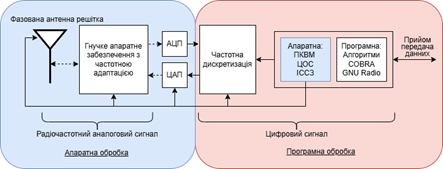

УДК 629.7 
 

Б. Ю. Погорєлов, "Київський політехнічний інститут імені Ігоря Сікорського” 

b.pohorielov.mp11@kpi.ua 

О. А. Повшенко, "Київський політехнічний інститут імені Ігоря Сікорського”, 

ORCID 0000-0003-2998-5950 

povshenko.oleksandr@lll.kpi.ua 

# Автоматизований портативний комплекс виявлення та аналізу радіосигналів 

## Анотація. 

В роботі запропоновано використання автоматизованого портативного комплексу для підвищення ефективності прийому, обробки та аналізу радіосигналів. Даний комплекс може бути використано для підвищення завадостійкості роботи каналу зв’язку передачі даних між центром керування та БПЛА. Проаналізовано сучасні підходи до реалізації таких систем.  

Ключові слова: автоматизований комплекс, цифрова обробка сигналів, БПЛА, радіосигнали. 

 

B. Pohorielov, National Technical University of Ukraine “Igor Sikorsky Kyiv Polytechnic Institute” 

b.pohorielov.mp11@kpi.ua 

O. Povshenko, National Technical University of Ukraine “Igor Sikorsky Kyiv Polytechnic Institute” 

ORCID 0000-0003-2998-5950 

povshenko.oleksandr@lll.kpi.ua 

Automated Portable System for Radio Signal Detection and Analysis 

Annotation. The paper proposes the use of an automated portable complex to improve the efficiency of receiving, processing, and analyzing radio signals. This complex can be used to increase the noise immunity of the data communication channel between the control center and the UAV. Modern approaches to the implementation of such systems are analyzed.  

Keywords: automated complex, digital signal processing, UAV, radio signals. 

--- 

Технологія програмно-визначеного радіо (ПВР) – це система радіозв’язку, у якій компоненти, які традиційно реалізовані в аналоговому апаратному забезпеченні, натомість реалізуються за допомогою програмного забезпечення на комп’ютері чи вбудованій системі. Системи ПВР є однією з найперспективніших у сфері автоматизації керування та забезпечення безпеки безпілотних літальних апаратів (БПЛА) [1]. Використання цифрової обробки сигналів (ЦОС) та адаптивних алгоритмів ПВР дає змогу автоматизувати процес аналізу спектру та переходу на обрану частоту, що сприяє підвищенню завадостійкості каналу зв’язку між БПЛА та центром керування.  

Завдяки цьому можна своєчасно виявити найменш завантажені канали зв’язку, що забезпечить стабільну та надійну передачу даних, а також дозволить адаптуватися до змін у радіоефірі. Таке рішення відкриває нові можливості для ефективного управління та безпеки БПЛА в умовах високих вимог до надійності зв’язку [2]. 

Пристрої, в яких використовують ПВР відходять від традиційної аналогової обробки сигналів за допомогою апаратних ресурсів, перекладаючи більшість завдань на програмне забезпечення. Автоматизований комплекс забезпечує обробку сигналів основної смуги, включаючи їхню генерацію та декодування, замінюючи традиційні фізичні елементи, такі як фільтри, підсилювачі, модулятори, демодулятори, детектори та роздільники та їхніми програмними аналогами, з тандемом меншого апаратного забезпечення. Це означає, що значна частина елементів фізичного рівня, визначаються на програмному етапі. Аналогічно, важливо зазначити, що сигнали перетворюються між аналоговою та цифровою областями, залежно від конкретного застосування. Це перетворення здійснюється за допомогою інтегрованих модулів аналого-цифрових перетворювачів (АЦП) та цифро-аналогових перетворювачів (ЦАП) усередині пристроїв з ПВР, які відіграють вирішальну роль. 

В роботі пропонується використати технологію ПВР для автоматизації аналізу спектру частот та виявлення найменш завантаженого радіоканалу, що забезпечить підвищення завадостійкості зв’язку між безпілотним літальним апаратом та центром керування. 

Для досягнення цієї мети необхідно вирішити такі завдання: 

Автоматизація аналізу спектру сигналів БПЛА – розробка методів моніторингу та обробки радіосигналів для виявлення характеристик та можливих перешкод у каналах зв’язку; 

Оптимізація вибору робочої частоти – створення алгоритмів для динамічного визначення найменш завантаженого каналу, що сприятиме стабільності та надійності зв’язку; 

Забезпечення стійкості каналу зв’язку – реалізація методів адаптивного управління частотою для зменшення впливу завад та покращення якості передачі даних між центром керування та БПЛА. 

Очікувані результати дослідження дозволять підвищити ефективність зв’язку та надійність керування БПЛА, що є критично важливим для їх використання у спеціальних та цивільних сферах. 

На рисунку 1 наведено типову архітектуру приладів з ПВР, яка складається з двох основних частин: апаратної та програмної. 

Рис. 1 Типова архітектура програмно-визначеного радіо 

Архітектура програмно-визначеного радіо для автоматизованого портативного комплексу включає: 

Антену – приймає радіосигнали. 

Апаратне забезпечення з частотною адаптацією – підсилює, фільтрує сигнал, виділяє потрібний частотний діапазон і пригнічує шуми, можливе перетворення на проміжну частоту. 

АЦП та ЦАП – перетворюють сигнал між аналоговою та цифровою формами. 

Частотну дискретизацію – виділяє канал, змінює частоту дискретизації для оптимізації обробки. 

Обробку – виконує складні алгоритми на ПЛІС, ЦОС або ASIC. 

Програмне забезпечення – реалізує обробку сигналів (CORBA, GNU Radio) [3]. 

В результаті проведеного дослідження розглянуто принципи побудови автоматизованого портативного комплексу для виявлення та аналізу радіосигналів, що базуються на технології програмно-визначеного радіо. Визначено, що використання таких систем здатне суттєво підвищити завадостійкість каналу зв’язку між БПЛА та центром керування, що є критично важливим для забезпечення стабільності та надійності передачі даних. 0 

## Бібліографічні посилання 

M. A. Ramos, R. Camacho, P. A. Buitrago, R. D. Urda, and J. P. Restrepo, "Software defined radio, a perspective from education", Frontiers in Education, vol. 8, Jan. 2024, Art. no. 1228610, doi: 10.3389/feduc.2023.1228610.  

V. V. Soboliev, M. M. Herashchenko, S. V. Rudnichenko, S. I. Trofimenko, and V. M. Ilyenko, "Modern approaches to the organization of a reliable, interference-resistant, and secure satellite communication channel with unmanned aerial vehicles", State Research Institute for Testing and Certification of Weapons and Military Equipment, vol. 7, no. 9, pp. 15, 2021, doi: 10.37701/dndivsovt.7.2021.09.  

S. Makarenko and S. Otrokh, "The use of SDR as sensor nodes of the intelligent system of management of radio emission data collection", Scientific Notes of the State University of Telecommunications, no. 1, pp. 15–20, 2023, doi: 10.31673/2786-8362.2023.010202.  